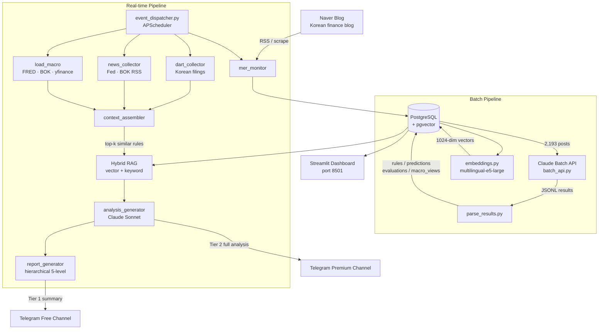

# mer-insight-pipeline

LLM batch processing + Hybrid RAG pipeline for unstructured text analysis

---

## Architecture



---

## Tech Stack

| Layer | Technology |
|---|---|
| LLM | Claude Sonnet 4.6 / Haiku 4.5 (Anthropic) |
| Batch API | Anthropic Batch API |
| Embeddings | `intfloat/multilingual-e5-large` (1024 dims) |
| Vector DB | PostgreSQL 16 + pgvector (HNSW index) |
| Scheduler | APScheduler 3.10 |
| Delivery | python-telegram-bot 21 |
| Data | FRED, BOK ECOS, BLS, MOLIT, DART, yfinance |
| Dashboard | Streamlit + Plotly |
| Infra | Docker Compose |

---

## Features

### Batch Processing
- Processes **2,193 blog posts** via Claude Batch API in parallel
- Extracts 4 insight types per post: `rule`, `prediction`, `evaluation`, `macro_view`
- Primary topic classification: 거시경제 / 기업분석 / 부동산 / 금융시장 / 정책 / 산업분석
- Stores structured JSONB + vector embeddings in PostgreSQL

### Hybrid RAG
- **Vector search** (pgvector HNSW) + **keyword search** combined
- Retrieves relevant past rules and analyses for each new event
- Embedding model: `intfloat/multilingual-e5-large` — **1,024 dimensions**

### Hierarchical Report Synthesis
- **5-level report hierarchy**: individual event → daily digest → weekly theme → monthly macro → quarterly outlook
- `report_generator.py` assembles context-aware summaries at each level

### Real-time Event Processing
- **7 scheduled jobs** via APScheduler:
  - Blog monitoring: every 5 min
  - DART (Korean stock filings): weekdays 08:00–18:00, every 10 min
  - Macro data update: every 1 hour
  - Macro threshold alerts: every 30 min
  - News collection (Fed/BOK RSS): every 30 min
  - Daily report: 21:00 KST
  - Macro data ingestion: daily
- Delivers to two Telegram channels (Tier 1 free / Tier 2 premium)

---

## Metrics

| Metric | Value |
|---|---|
| Processed posts | 2,193 |
| Insight types | 4 (rule, prediction, evaluation, macro_view) |
| Embedding dimensions | 1,024 |
| Scheduled jobs | 7 |
| Report hierarchy levels | 5 |
| Macro indicators tracked | KOSPI, USD/KRW, VIX, BTC, WTI, CPI, unemployment |

---

## Setup

### Prerequisites
- Docker & Docker Compose
- Anthropic API key
- Telegram bot token (optional — for delivery)
- External API keys (FRED, BOK, BLS, MOLIT — all free)

### Quick Start

```bash
# 1. Clone and configure
git clone https://github.com/11e3/mer-insight-pipeline.git
cd mer-insight-pipeline
cp .env.example .env
# → Fill in your API keys in .env

# 2. Set up prompts
cp config/prompts.example.py config/prompts.py
# → Write your prompts in config/prompts.py

# 3. Start services
docker compose up -d

# 4. Initialize DB schema
docker compose exec db psql -U mer -d mer_pipeline -f /docker-entrypoint-initdb.d/init_db.sql

# 5. Load posts and run batch extraction
python scripts/run_batch.py all

# 6. Start real-time dispatcher
python -m src.pipeline.event_dispatcher
```

### Dashboard

```bash
streamlit run src/dashboard/app.py
# → http://localhost:8501
```

---

## Environment Variables

See [.env.example](.env.example) for all required variables.

| Variable | Description |
|---|---|
| `DATABASE_URL` | PostgreSQL connection string |
| `ANTHROPIC_API_KEY` | Claude API key |
| `TELEGRAM_BOT_TOKEN` | Telegram bot token |
| `TELEGRAM_TIER1_CHAT_ID` | Free channel chat ID |
| `TELEGRAM_TIER2_CHAT_ID` | Premium channel chat ID |
| `FRED_API_KEY` | FRED economic data (free) |
| `BOK_API_KEY` | Bank of Korea ECOS API (free) |
| `BLS_API_KEY` | US Bureau of Labor Statistics (free) |
| `MOLIT_API_KEY` | Korea real estate data / data.go.kr (free) |

---

## Project Structure

```
mer-insight-pipeline/
├── config/
│   ├── settings.py           # All configuration, loaded from .env
│   └── prompts.example.py    # Prompt structure template (prompts.py is gitignored)
├── src/
│   ├── extract/
│   │   ├── batch_api.py      # Claude Batch API orchestration
│   │   ├── embeddings.py     # Vector embedding generation
│   │   ├── parse_results.py  # Batch result parsing → DB
│   │   └── realtime_extractor.py
│   ├── ingest/
│   │   ├── load_posts.py     # Blog posts → PostgreSQL
│   │   ├── load_macro.py     # FRED / BOK / yfinance
│   │   ├── load_bls.py       # US labor statistics
│   │   ├── load_realestate.py
│   │   └── load_trade.py
│   ├── pipeline/
│   │   ├── event_dispatcher.py   # Main runtime (APScheduler)
│   │   ├── mer_monitor.py        # Blog RSS watcher
│   │   ├── dart_collector.py     # DART filings
│   │   ├── news_collector.py     # RSS news feeds
│   │   ├── context_assembler.py  # RAG context builder
│   │   ├── analysis_generator.py # Claude analysis
│   │   └── report_generator.py   # Hierarchical report synthesis
│   ├── delivery/
│   │   ├── telegram_bot.py   # Telegram delivery (2 tiers)
│   │   └── formatters.py
│   └── dashboard/            # Streamlit dashboard
├── scripts/
│   └── run_batch.py          # Phase-based pipeline runner
├── docker-compose.yml
├── Dockerfile
└── requirements.txt
```

---

## License

MIT
