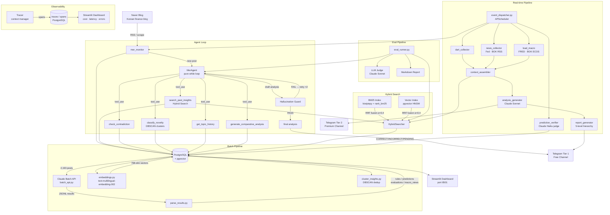
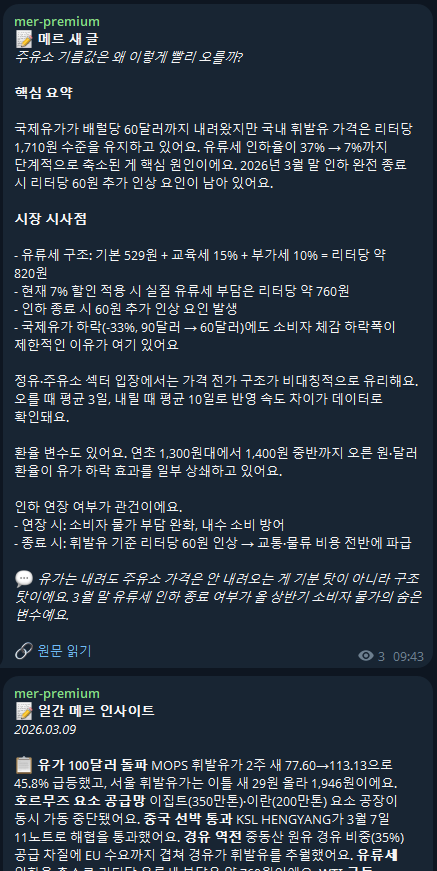
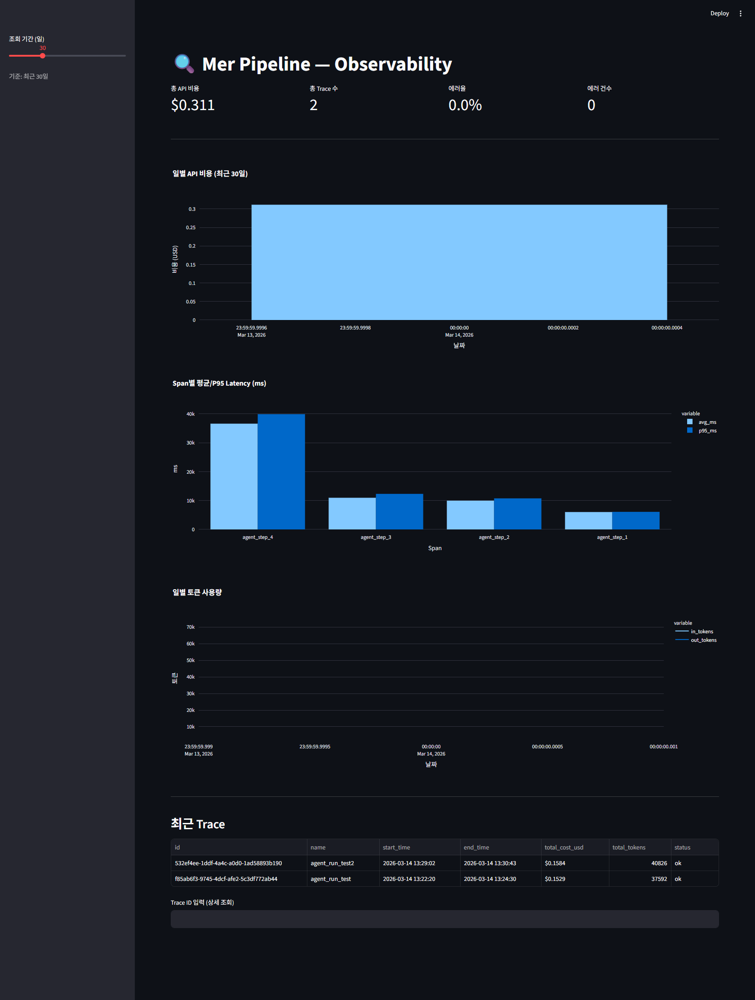

# mer-insight-pipeline

**mer-insight-pipeline** monitors [Mer's Korean finance blog](https://blog.naver.com/ranto28), extracts structured insights from 2,193 posts using the Claude Batch API, and delivers citation-grounded analysis to Telegram subscribers within minutes of each new post.

Every component is production-wired: a hybrid retriever backed by 25,090 indexed insights, an LLM agent loop that decides its own tool calls, a hallucination guard that blocks uncited claims, a daily prediction verification pipeline (Claude Haiku as judge, 5,368 tracked predictions), per-call cost/latency tracing, and an eval harness with an LLM judge — all running on PostgreSQL + pgvector with no vector-DB vendor lock-in.

**~$0.15 per post** (4 agent iterations avg) · **$4.50/month** at 30 posts/month

[한국어 README](README_KR.md)

---

## Architecture



---

## Hybrid Search — Experiment Results

Combining BM25 (keyword) and vector (embedding) retrieval via RRF significantly improves recall over either method alone.

**Gold dataset**: 5 Korean economic queries × 5 relevant insights each, K=5

| Method | Precision@5 | Recall@5 | MRR |
|--------|------------|---------|-----|
| Vector only | 0.52 | 0.52 | 0.90 |
| BM25 only | 0.44 | 0.44 | 0.80 |
| **Hybrid (RRF)** | **1.00** | **1.00** | **1.00** |

paired t-test: t=4.707, **p=0.0093** (statistically significant)

**Why they differ**

- **Vector** excels at semantic paraphrasing — "rate hike hurts real estate" ↔ "property values are inversely correlated with interest rates" — but dilutes rare keywords like "4.6%", "30Y", "SVB" in embedding space
- **BM25** pinpoints specific numbers and proper nouns, but fails on synonyms and varied phrasing
- **RRF** combines both: each method covers the blind spots of the other, maximising recall

```bash
python -m src.search.experiment --k 5
```

---

## Agent Loop — Why Not a Fixed Prompt?

The original pipeline ran a fixed prompt on every new post. The agent loop lets the LLM **decide what information it needs** and call tools in sequence.

```
New post received
  → LLM: "Need past insights on interest rates" → search_past_insights("rate cut")
  → LLM: "Does this contradict prior claims?"  → check_contradiction(...)
  → LLM: "Is this a new topic?"                → classify_novelty(...)
  → LLM: "Enough context. Generate analysis."
```

**Implementation**
- Pure `while` loop with Claude `tool_use` API — no frameworks
- `max_iterations=5`; Hallucination Guard failure triggers up to 2 automatic re-generations
- Falls back to `analysis_generator.py` on agent error

**Analysis output — example**

Each analysis is grounded in past insights retrieved from the 25,090-insight DB and cited inline. Example from a post about Hormuz Strait supply chain risk (2026-03-08):

```
*핵심 요약* (Core summary)

🎯 The real threat from a Hormuz closure isn't oil/LNG — it's urea supply chain
   collapse. [ref: ins_2316]
   Korea has zero domestic production and only 15 days of public stockpile.
   [ref: ins_15390]

*과거 발언과의 비교* (vs. past statements)

- Mer warned since Dec 2023 that the 2021 urea shortage was never structurally
  resolved. [ref: ins_7022]
- Then: China-only risk. Now: simultaneous multi-country supply cut — crisis
  layer has expanded. [ref: ins_2316]
- Dependency fell to 67% post-2021, quietly rose back to 91.8% by 2023.
  [ref: ins_15390, ins_23520]
- New angle not in past insights: Egypt sources Israeli gas → converts to urea.
  [ref: none]

*시장 시사점* (Market implications)

- Lotte Fine Chemical: price pass-through upside, offset by import cost risk.
  [ref: ins_15391]
- Logistics/trucking: urea shortage → truck shutdowns → freight spike across
  construction, cement, retail. [ref: ins_2308]
- Agri inflation: urea is fertiliser feedstock, not just AdBlue. [ref: ins_2316]

💬 "In 2021 it was China alone. In 2026 multiple producers drop simultaneously."
   [ref: ins_2316]
```

Citations are verified by the Hallucination Guard before delivery.



---

## Prediction Verification Pipeline

Every `prediction`-type insight extracted from Mer's posts is stored in `mer_predictions` and verified daily by Claude Haiku acting as an automated judge.

**Context fed to Claude per batch:**

| Source | What's included |
|--------|----------------|
| Monthly macro summary | KOSPI hi/lo/avg, USD/KRW, WTI, US10Y, Fed rate, VIX, BTC — from FRED + BOK ECOS |
| Naver Finance stocks | Monthly H/L/close for historical data + daily close for recent 90 days (10 major equities) |
| DART filings + news | Corporate events collected since the oldest pending prediction date |
| Auto-analyses | Mer post analyses from the same period |

**Verdicts**

| Verdict | Condition |
|---------|-----------|
| `CORRECT` | Predicted outcome confirmed by context or Claude's knowledge |
| `INCORRECT` | Predicted outcome contradicted by evidence |
| `PENDING` | Condition not yet met, or insufficient information — re-checked next day |

Predictions stay in the queue until resolved — no expiry. BATCH_SIZE=20 predictions per Haiku call; the daily 20:00 run processes all open predictions before the daily report is generated.

```bash
# One-time backlog clearance
gcloud run jobs execute report-generator --args="--job,verify_predictions" --region=asia-northeast3
```

---

## Hierarchical Report Pipeline

Rather than generating a single flat summary, reports are produced in a **5-level hierarchy** where each level's output becomes the raw material for the next.

```
Annual   (Dec 31 21:00)    ← synthesises 4 quarterly reports  (2 Claude calls)
  └─ Quarterly (last day of Mar/Jun/Sep/Dec 21:00) ← synthesises 3 monthly reports
       └─ Monthly (last day 21:00) ← synthesises 4 weekly reports
            └─ Weekly (Sun 21:00) ← synthesises 7 daily reports
                 └─ Daily (21:00) ← summarises that day's agent analyses
```

Each level is instructed to find **patterns invisible at the level below** — not to copy-paste or re-list:

```
Weekly  → "What thread connected this week's posts?"
Monthly → "What structural shift happened across weeks?"
Annual  → "What were the two defining themes of the year?"
```

When sub-reports are missing, the generator falls back to raw macro data (KOSPI, rates, VIX, trade balance) and produces commentary directly.

| Mode | Input | Constraint |
|------|-------|------------|
| `_commentary` | Raw macro numbers | No invented figures |
| `_synthesis` | Sub-reports (text) | No copy-paste — find cross-level connections only |

---

## Hallucination Guard

Automatically detects **uncited claims** in the agent's output and triggers re-generation.

**Required output format** (instructed in system prompt):
```
US Treasury yields are expected to decline in H2. [ref: ins_22737, ins_16440]
This aligns with Fed rate-cut signalling.          [ref: ins_16433]
Inflation re-acceleration risk remains, however.   [ref: none]
```

**Verdicts**

| Verdict | Condition |
|---------|-----------|
| `GROUNDED` | `[ref: ins_ID]` present and ID exists in `mer_insights` |
| `UNGROUNDED` | Cited ID does not exist in DB |
| `UNSUPPORTED` | No citation tag at all |
| `NONE_DECLARED` | Explicitly tagged `[ref: none]` — accepted |

UNGROUNDED + UNSUPPORTED ratio > 20% → re-generation triggered (max 2 retries)

---

## Observability

Every Claude call is wrapped in a `Tracer` context manager that records cost and latency to PostgreSQL and surfaces them in a Streamlit dashboard.

```python
async with Tracer(conn, trace_name="agent_run") as tracer:
    resp = await tracer.call(
        client.messages.create,
        span_name="agent_step_1",
        model=MODEL_SONNET,
        messages=...,
    )
```

**Tracked per span**: `model`, `input_tokens`, `output_tokens`, `latency_ms`, `cost_usd`, `tool_calls`, `error`

**Token pricing** (claude-sonnet-4-6): $3/1M input · $15/1M output

Example trace from a real agent run (4 iterations):

| Span | Input tokens | Output tokens | Cost | Latency |
|------|-------------|--------------|------|---------|
| agent_step_1 | 5,330 | 293 | $0.0204 | 6.1s |
| agent_step_2 | 7,763 | 406 | $0.0294 | 9.1s |
| agent_step_3 | 9,584 | 687 | $0.0391 | 12.5s |
| agent_step_4 | 11,571 | 1,958 | $0.0641 | 40.3s |
| **Total** | **34,248** | **3,344** | **$0.153** | **~2 min** |

Context grows each iteration as tool results accumulate — visible in the token progression.

```bash
streamlit run src/dashboard/observability.py   # http://localhost:8501
```



---

## Eval Pipeline

```bash
# Retrieval only — no Claude calls, fast
python -m src.eval.eval_runner --mode retrieval_only --k 5

# Full — Retrieval + LLM Judge
python -m src.eval.eval_runner --mode full --k 5
```

**Retrieval results** (gold dataset, K=5):

| Metric | Score |
|--------|-------|
| Precision@5 | 1.00 |
| Recall@5 | 1.00 |
| MRR | 1.00 |

**LLM Judge metrics** (Claude Sonnet as judge, 1–5 scale normalised to 0–1):

| Metric | Description |
|--------|-------------|
| Context Relevance | Retrieved context vs. query relevance |
| Faithfulness | Analysis grounded in sources (inverse hallucination) |
| Answer Relevance | Analysis answers the original question |

---

## Tech Stack

<!-- AUTO:tech_stack -->
| Layer | Technology |
|-------|------------|
| LLM (analysis · agent) | `claude-sonnet-4-6` |
| LLM (extraction · verification) | `claude-haiku-4-5-20251001` |
| Batch API | Anthropic Batch API |
| Embeddings | Vertex AI `text-multilingual-embedding-002` (768 dims) |
| Vector DB | Cloud SQL PostgreSQL 16 + pgvector (HNSW index) |
| Keyword Search | rank-bm25 + kiwipiepy (Korean morphological analysis) |
| Hybrid Fusion | Reciprocal Rank Fusion (RRF, α=0.4) |
| Scheduler | GCP Cloud Scheduler + Cloud Run Jobs |
| Delivery | python-telegram-bot 21 |
| Data Sources | FRED, BOK ECOS, BLS, MOLIT, DART, Naver Finance |
| Dashboard | Streamlit (Cloud Run Service) |
| Infra | GCP Cloud Run Jobs + Cloud SQL |
<!-- END:tech_stack -->

---

## Metrics

| Metric | Value |
|--------|-------|
| Processed posts | 2,193 |
| Extracted insights | 25,090 |
| Tracked predictions | 5,368 |
| Insight types | 4 (rule, prediction, evaluation, macro_view) |
| Embedding dimensions | 768 |
| BM25 index size | 16,126 canonical documents |
| Scheduled jobs | 11 |
| Report hierarchy levels | 5 |
| Cost per post (agent) | ~$0.15 |
| Macro indicators tracked | KOSPI, USD/KRW, WTI, VIX, BTC, US10Y, Fed rate, CPI, unemployment |

---

## Setup

### Prerequisites

**Local dev**
- Docker & Docker Compose
- Anthropic API key
- Telegram bot token

**Production (GCP)**
- GCP account + `gcloud` CLI
- Anthropic API key, Telegram bot token
- See [docs/gcp_setup.md](docs/gcp_setup.md) for full GCP setup

### Local Quick Start

```bash
# 1. Clone and configure
git clone https://github.com/11e3/mer-insight-pipeline.git
cd mer-insight-pipeline
cp .env.example .env        # fill in your API keys
cp config/prompts.example.py config/prompts.py

# 2. Start the database
docker compose up -d db

# 3. Run batch extraction (2,193 posts → 25,090 insights)
python scripts/run_batch.py all

# 4. Build BM25 index cache
python -c "
import asyncio, asyncpg, os
from src.search.bm25_index import BM25Index
from dotenv import load_dotenv
load_dotenv()
async def build():
    conn = await asyncpg.connect(os.environ['DATABASE_URL'])
    idx = BM25Index()
    await idx.build(conn)
    idx.save('data/bm25_cache.pkl')
    await conn.close()
asyncio.run(build())
"

# 5. Run a job once (or start the always-on dispatcher)
python -m scripts.run_job --job mer_check
python -m src.pipeline.event_dispatcher   # always-on mode (local only)
```

### Production Deploy (GCP Cloud Run)

```bash
# Build & push image
IMAGE="asia-northeast3-docker.pkg.dev/YOUR_PROJECT/mer-pipeline/app:latest"
docker build -t $IMAGE . && docker push $IMAGE

# Deploy jobs + scheduler
# → full instructions in docs/gcp_setup.md
```

Cloud Scheduler triggers each Cloud Run Job on its own schedule:

| Job | Schedule |
|-----|----------|
<!-- AUTO:jobs -->
| Job | Schedule |
|-----|----------|
| `mer` | every 5 min |
| `dart` | every 10 min, 8-18h |
| `macro_update` | every 1h |
| `macro_alert` | every 30 min |
| `news` | every 30 min |
| `verify_predictions` | 20:00 |
| `report_daily` | 21:00 |
| `report_weekly` | Sun 21:00 |
| `report_monthly` | last day 21:00 |
| `report_quarterly` | 3/6/9/12 last day 21:00 |
| `report_annual` | 12/31 21:00 |
<!-- END:jobs -->

### Observability Dashboard

```bash
# Local
streamlit run src/dashboard/observability.py   # http://localhost:8501

# Production: Cloud Run Service (see docs/gcp_setup.md)
```

### Run Eval

```bash
python -m src.eval.eval_runner --mode retrieval_only
python -m src.search.experiment --k 5
```

---

## Environment Variables

See [.env.example](.env.example) for all required variables.

| Variable | Description |
|----------|-------------|
| `DATABASE_URL` | PostgreSQL connection string |
| `ANTHROPIC_API_KEY` | Claude API key |
| `TELEGRAM_BOT_TOKEN` | Telegram bot token |
| `GCP_PROJECT_ID` | GCP project ID (production) |
| `TELEGRAM_TIER1_CHAT_ID` | Telegram channel chat ID |
| `FRED_API_KEY` | FRED economic data (free) |
| `BOK_API_KEY` | Bank of Korea ECOS API (free) |
| `BLS_API_KEY` | US Bureau of Labor Statistics (free) |
| `MOLIT_API_KEY` | Korea real estate data / data.go.kr (free) |

---

## Project Structure

```
mer-insight-pipeline/
├── config/
│   ├── settings.py               # All configuration, loaded from .env
│   └── prompts.example.py        # Prompt structure template
├── src/
│   ├── agent/                    # LLM Agent Loop
│   │   ├── agent.py              # Pure while loop, max_iterations=5
│   │   ├── tools.py              # 5 tools: search / contradiction / novelty / history / compare
│   │   ├── prompts.py            # System prompt with citation tagging instructions
│   │   └── state.py              # Message history & iteration state
│   ├── search/                   # Hybrid Search
│   │   ├── bm25_index.py         # BM25 with kiwipiepy tokenizer + pickle cache
│   │   ├── vector_index.py       # pgvector HNSW wrapper
│   │   ├── hybrid.py             # RRF fusion (α=0.4)
│   │   └── experiment.py         # A/B comparison: vector vs BM25 vs hybrid
│   ├── guard/                    # Hallucination Guard
│   │   ├── guard.py              # GROUNDED / UNGROUNDED / UNSUPPORTED verdict
│   │   ├── citation_tracker.py   # [ref: ins_ID] tag parser
│   │   └── self_correct.py       # Auto re-generation on FAIL (max 2 retries)
│   ├── observability/            # LLM Call Tracing
│   │   ├── tracer.py             # Tracer context manager + @trace_llm_call decorator
│   │   └── storage.py            # traces / spans PostgreSQL CRUD
│   ├── eval/                     # Eval Pipeline
│   │   ├── eval_runner.py        # Main runner (--mode retrieval_only | full)
│   │   ├── metrics.py            # Precision@K, Recall@K, MRR
│   │   ├── llm_judge.py          # Context Relevance / Faithfulness / Answer Relevance
│   │   ├── eval_dataset.py       # Gold dataset loader
│   │   └── report.py             # Markdown + JSON report generator
│   ├── extract/
│   │   ├── batch_api.py          # Claude Batch API orchestration
│   │   ├── embeddings.py         # Vector embedding generation
│   │   ├── parse_results.py      # Batch result parsing → DB
│   │   └── realtime_extractor.py # Real-time insight extraction (Haiku)
│   ├── ingest/
│   │   ├── load_posts.py
│   │   ├── load_macro.py         # FRED / BOK ECOS (yfinance removed — GCP blocked)
│   │   ├── load_bls.py
│   │   ├── load_realestate.py
│   │   └── load_trade.py
│   ├── pipeline/
│   │   ├── event_dispatcher.py   # Main runtime (APScheduler) + agent integration
│   │   ├── mer_monitor.py        # Blog RSS watcher
│   │   ├── dart_collector.py     # DART filings (Korean stock exchange)
│   │   ├── news_collector.py     # RSS feeds: Fed · BOK · geopolitics
│   │   ├── context_assembler.py  # RAG context builder
│   │   ├── analysis_generator.py # Claude analysis (fallback)
│   │   ├── prediction_verifier.py # Daily Claude Haiku batch verification
│   │   └── report_generator.py   # 5-level hierarchical synthesis
│   ├── delivery/
│   │   ├── telegram_bot.py       # Two-tier Telegram delivery
│   │   └── formatters.py
│   └── dashboard/
│       ├── app.py                # Main dashboard
│       └── observability.py      # LLM cost / latency / error dashboard
├── eval_data/
│   └── gold.json                 # Gold dataset: 5 queries × 5 relevant insight IDs
├── results/                      # Eval reports & experiment outputs
├── scripts/
│   ├── init_db.sql               # PostgreSQL schema (includes traces / spans)
│   ├── migrate_predictions.py    # One-time: mer_insights → mer_predictions backfill
│   └── run_batch.py
├── docker-compose.yml
├── Dockerfile
└── requirements.txt
```

---

## License

MIT
