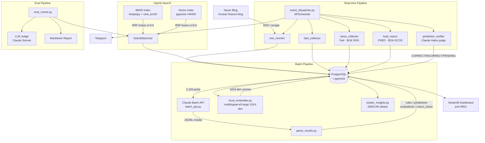

# mer-insight-pipeline

**mer-insight-pipeline** automates financial prediction tracking and verification from Mer (ranto28)'s 2,193 blog posts using Korean macro data (FRED, BOK ECOS, DART, Naver Finance, Fed/BOK RSS, Google News).

[Mer (ranto28)](https://blog.naver.com/ranto28), a Korean finance blogger, publishes macro predictions across 2,193 posts. This pipeline extracts those predictions with Claude Batch API, collects real market data from 6 external sources, and verifies each prediction daily with Claude Haiku as an automated judge — 5,368 predictions tracked so far. Retrieval is powered by hybrid BM25 + pgvector search (25,090 indexed insights, α=0.6 production default) on PostgreSQL with no vector-DB vendor lock-in.

[](https://codecov.io/gh/11e3/mer-insight-pipeline)
[](http://34.50.19.176:8501)

[한국어 README](README_KR.md)

---

## Architecture



---

## Prediction Verification Pipeline

Every `prediction`-type insight extracted from Mer's posts is stored in `mer_predictions` and verified daily by Claude Haiku acting as an automated judge.

**Context fed to Claude per batch:**

| Source | What's included |
|--------|----------------|
| Monthly macro summary | KOSPI hi/lo/avg, USD/KRW, WTI, US10Y, Fed rate, VIX, BTC — from FRED + BOK ECOS |
| Naver Finance stocks | Monthly H/L/close for historical data + daily close for recent 90 days (10 major equities) |
| DART filings + news | Corporate events collected since the oldest pending prediction date |
| Auto-analyses | Mer post analyses from the same period |

**Verdicts**

| Verdict | Condition |
|---------|-----------|
| `CORRECT` | Predicted outcome confirmed by context or Claude's knowledge |
| `INCORRECT` | Predicted outcome contradicted by evidence |
| `PENDING` | Condition not yet met, or insufficient information — re-checked next day |

Predictions stay in the queue until resolved — no expiry. BATCH_SIZE=20 predictions per Haiku call; the daily 20:00 run processes all open predictions.

---

## Macro Data Pipeline

The pipeline collects financial and economic data from 6 external sources on scheduled intervals, stored in `macro_daily` and `events` tables for prediction verification and report generation.

| Source | Data | Schedule | Module |
|--------|------|----------|--------|
| FRED API | VIX, US 10Y Treasury, WTI crude, BTC/USD, Fed Funds Rate, CPI YoY, Unemployment | Every 30 min | `src/ingest/load_macro.py` |
| BOK ECOS | USD/KRW, KOSPI, KOSDAQ, Korea base rate | Every 30 min | `src/ingest/load_macro.py` |
| Naver Finance | Daily close prices for 10 major Korean stocks (Samsung Electronics, SK Hynix, Hyundai Motor, Kia, LG Energy Solution, POSCO Holdings, Samsung SDI, Kakao, Naver, Celltrion) | On verification | `src/pipeline/prediction_verifier.py` |
| DART | Corporate disclosure filings (사업보고서, 주요사항보고서, M&A, etc.) via RSS | Every 10 min, 8–18h (weekdays) | `src/pipeline/dart_collector.py` |
| Fed / BOK RSS | Central bank press releases, rate decisions, monetary policy | Every 30 min | `src/pipeline/news_collector.py` |
| Google News | Geopolitical events — sanctions, tariffs, trade war keywords | Every 30 min | `src/pipeline/news_collector.py` |

All macro data feeds into **prediction verification context** — monthly aggregates + recent 30-day daily values provided to Claude Haiku as evidence for judging predictions.

---

## Search Infrastructure

Hybrid BM25 + vector search serves as the retrieval backbone for context assembly and the eval pipeline.

Query embeddings use `intfloat/multilingual-e5-large` (1024-dim) — the same model used to index the production DB.

```bash
python -m src.search.experiment --mode ablation --dataset eval_data/gold_extended.json --k 5
```

**Alpha ablation** — N=200 queries, K=5:

| α (BM25 weight) | Precision@5 | Recall@5 | MRR |
|----------------|-------------|----------|-----|
| **α=0.0** | 0.199 | 0.995 | **0.995** |
| α=0.2 | 0.199 | 0.995 | 0.995 |
| α=0.3 | 0.199 | 0.995 | 0.990 |
| α=0.4 | 0.199 | 0.995 | 0.986 |
| **α=0.6** ★ | **0.200** | **1.000** | 0.968 |
| α=0.8 | 0.199 | 0.995 | 0.960 |
| α=1.0 | 0.196 | 0.980 | 0.935 |

Production default: **α=0.6**.

**Key observations**:
- α=0.6 is the only setting that achieves perfect Recall (1.000) and the highest Precision (0.200) — chosen as production default to avoid missing any predictions
- Best MRR is vector-only (α=0.0, MRR=0.995); hybrid trades a slight MRR drop (−2.7pp) for perfect Recall
- BM25-only (α=1.0) trails vector-only on both Recall (0.980 vs 0.995) and MRR (0.935 vs 0.995) — Korean financial text benefits more from semantic search than keyword-exact matching

**Why they differ**

- **Vector** excels at semantic paraphrasing — "rate hike hurts real estate" ↔ "property values are inversely correlated with interest rates" — and leads on MRR
- **BM25** pinpoints specific numbers and proper nouns, but fails on synonyms and varied phrasing
- **RRF** at α=0.6 covers the recall gap of pure vector while preserving strong precision

---

## Eval Pipeline

```bash
# Retrieval only — no Claude calls, fast
python -m src.eval.eval_runner --mode retrieval_only --k 5

# Full — Retrieval + LLM Judge
python -m src.eval.eval_runner --mode full --k 5
```

**LLM Judge metrics** (Claude Sonnet as judge, 1–5 scale normalised to 0–1):

| Metric | Description |
|--------|-------------|
| Context Relevance | Retrieved context vs. query relevance |
| Faithfulness | Analysis grounded in sources (inverse hallucination) |
| Answer Relevance | Analysis answers the original question |

---

## Tech Stack

| Layer | Technology |
|-------|------------|
| LLM (analysis · verification) | `claude-sonnet-4-6` |
| LLM (extraction) | `claude-haiku-4-5-20251001` |
| Batch API | Anthropic Batch API |
| Embeddings | `intfloat/multilingual-e5-large` (1024-dim, local) |
| Vector DB | Cloud SQL PostgreSQL 16 + pgvector (HNSW index) |
| Keyword Search | rank-bm25 + kiwipiepy (Korean morphological analysis) |
| Hybrid Fusion | Reciprocal Rank Fusion (RRF, α=0.6) |
| Scheduler | GCP Cloud Scheduler + Cloud Run Jobs |
| Delivery | python-telegram-bot 21 |
| Data Sources | FRED, BOK ECOS, DART, Naver Finance, Fed/BOK RSS, Google News |
| Dashboard | Streamlit |
| Infra | GCP Cloud Run Jobs + Cloud SQL |

---

## Metrics

| Metric | Value |
|--------|-------|
| Processed posts | 2,193 |
| Extracted insights | 25,090 |
| Tracked predictions | 5,368 |
| Insight types | 4 (rule, prediction, evaluation, macro_view) |
| Embedding dimensions | 1024 |
| BM25 index size | 16,126 canonical documents |
| GCP Cloud Run jobs | 4 |
| Macro indicators tracked | KOSPI, USD/KRW, WTI, VIX, BTC, US10Y, Fed rate, CPI, unemployment |

---

## Setup

### Prerequisites

**Local dev**
- Docker & Docker Compose
- Anthropic API key
- Telegram bot token

**Production (GCP)**
- GCP account + `gcloud` CLI
- Anthropic API key, Telegram bot token
- See [docs/gcp_setup.md](docs/gcp_setup.md) for full GCP setup

### Local Quick Start

```bash
# 1. Clone and configure
git clone https://github.com/11e3/mer-insight-pipeline.git
cd mer-insight-pipeline
cp .env.example .env        # fill in your API keys
cp config/prompts.example.py config/prompts.py

# 2. Start the database
docker compose up -d db

# 3. Run batch extraction (2,193 posts → 25,090 insights)
python scripts/run_batch.py all

# 4. Build BM25 index cache
python -c "
import asyncio, asyncpg, os
from src.search.bm25_index import BM25Index
from dotenv import load_dotenv
load_dotenv()
async def build():
    conn = await asyncpg.connect(os.environ['DATABASE_URL'])
    idx = BM25Index()
    await idx.build(conn)
    idx.save('data/bm25_cache.pkl')
    await conn.close()
asyncio.run(build())
"

# 5. Run a job once (or start the always-on dispatcher)
python -m scripts.run_job --job mer_check
python -m src.pipeline.event_dispatcher   # always-on mode (local only)
```

### Production Deploy (GCP Cloud Run)

```bash
# Build & push image
IMAGE="asia-northeast3-docker.pkg.dev/YOUR_PROJECT_ID/mer-pipeline/app:latest"
docker build -t $IMAGE . && docker push $IMAGE

# Deploy jobs + scheduler
# → full instructions in docs/gcp_setup.md
```

Cloud Scheduler triggers each Cloud Run Job on its own schedule:

| Job | Schedule |
|-----|----------|
| `mer_check` | every 5 min |
| `dart_check` | every 10 min, 8–18h (weekdays) |
| `macro_check` | every 30 min |
| `verify_predictions` | 20:00 daily |

`macro_check` consolidates macro data update, macro alert detection, and news collection into a single job execution.

### Prediction Dashboard

```bash
streamlit run src/dashboard/prediction_dashboard.py   # http://localhost:8501
```

### Run Eval

```bash
python -m src.eval.eval_runner --mode retrieval_only
python -m src.search.experiment --k 5
```

---

## Environment Variables

See [.env.example](.env.example) for all required variables.

| Variable | Required | Description |
|----------|----------|-------------|
| `DATABASE_URL` | ✓ | PostgreSQL connection string |
| `ANTHROPIC_API_KEY` | ✓ | Claude API key |
| `TELEGRAM_BOT_TOKEN` | delivery | Telegram bot token |
| `TELEGRAM_TIER1_CHAT_ID` | delivery | Telegram channel chat ID |
| `GCP_PROJECT_ID` | production | GCP project ID |
| `GCP_LOCATION` | production | Vertex AI region (default: us-central1) |
| `FRED_API_KEY` | optional | FRED economic data (free) |
| `BOK_API_KEY` | optional | Bank of Korea ECOS API (free) |

---

## Project Structure

```
mer-insight-pipeline/
├── config/
│   ├── settings.py               # All configuration, loaded from .env
│   └── prompts.example.py        # Prompt structure template
├── src/
│   ├── search/                   # Search Infrastructure
│   │   ├── bm25_index.py         # BM25 with kiwipiepy tokenizer + pickle cache
│   │   ├── vector_index.py       # pgvector HNSW wrapper (1024-dim)
│   │   ├── hybrid.py             # RRF fusion (α=0.6)
│   │   └── experiment.py         # A/B comparison: vector vs BM25 vs hybrid
│   ├── eval/                     # Eval Pipeline
│   │   ├── eval_runner.py        # Main runner (--mode retrieval_only | full)
│   │   ├── metrics.py            # Precision@K, Recall@K, MRR
│   │   ├── llm_judge.py          # Context Relevance / Faithfulness / Answer Relevance
│   │   ├── eval_dataset.py       # Gold dataset loader
│   │   └── report.py             # Markdown + JSON report generator
│   ├── extract/
│   │   ├── batch_api.py          # Claude Batch API orchestration
│   │   ├── local_embedder.py     # multilingual-e5-large 1024-dim (default)
│   │   ├── embedder.py           # Embedder protocol + factory (LocalEmbedder default)
│   │   ├── parse_results.py      # Batch result parsing → DB
│   │   └── realtime_extractor.py # Real-time insight extraction (Haiku)
│   ├── ingest/
│   │   ├── load_posts.py
│   │   └── load_macro.py         # FRED / BOK ECOS macro data collection
│   ├── pipeline/
│   │   ├── event_dispatcher.py   # Main runtime (APScheduler, 6 local schedules)
│   │   ├── mer_monitor.py        # Blog RSS watcher (primary data source)
│   │   ├── dart_collector.py     # DART filings (Korean corporate disclosure)
│   │   ├── news_collector.py     # RSS feeds: Fed · BOK · geopolitics
│   │   ├── analysis_generator.py # Claude Sonnet post analysis
│   │   └── prediction_verifier.py # Daily Claude Haiku batch verification
│   ├── delivery/
│   │   ├── telegram_bot.py       # Telegram delivery (Tier 1 channel)
│   │   └── formatters.py
│   └── dashboard/
│       ├── observability.py      # Cost / latency dashboard (local reference)
│       └── prediction_dashboard.py # Prediction accuracy dashboard
├── app.py                        # Streamlit Cloud entry point → prediction_dashboard
├── eval_data/
│   └── gold_extended.json        # Gold dataset: 200 queries with relevant insight IDs
├── results/                      # Eval reports & experiment outputs
├── scripts/
│   ├── init_db.sql               # PostgreSQL schema
│   ├── run_batch.py              # Batch extraction orchestrator
│   ├── run_job.py                # Cloud Run Job entry point (mer_check / dart_check / macro_check / verify_predictions)
│   └── migrate_predictions.py    # One-time: mer_insights → mer_predictions backfill
├── docker-compose.yml
├── Dockerfile
└── requirements.txt
```

---

## License

MIT
