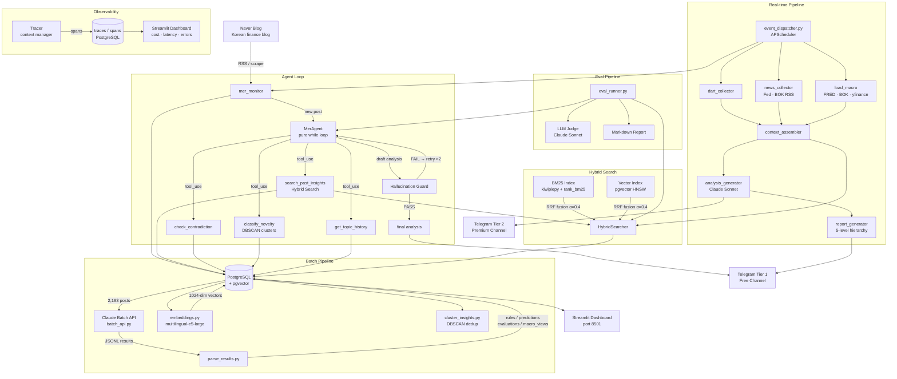

# mer-insight-pipeline

LLM Agent · Hybrid RAG · Observability pipeline for automated Korean finance blog analysis

[한국어 README](README_KR.md)

---

## Architecture



---

## Hybrid Search — Experiment Results

Combining BM25 (keyword) and vector (embedding) retrieval via RRF significantly improves recall over either method alone.

**Gold dataset**: 5 Korean economic queries × 5 relevant insights each, K=5

| Method | Precision@5 | Recall@5 | MRR |
|--------|------------|---------|-----|
| Vector only | 0.52 | 0.52 | 0.90 |
| BM25 only | 0.44 | 0.44 | 0.80 |
| **Hybrid (RRF)** | **1.00** | **1.00** | **1.00** |

**Why they differ**

- **Vector** excels at semantic paraphrasing — "rate hike hurts real estate" ↔ "property values are inversely correlated with interest rates" — but dilutes rare keywords like "4.6%", "30Y", "SVB" in embedding space
- **BM25** pinpoints specific numbers and proper nouns, but fails on synonyms and varied phrasing
- **RRF** combines both: each method covers the blind spots of the other, maximising recall

```bash
python -m src.search.experiment --k 5
```

---

## Agent Loop — Why Not a Fixed Prompt?

The original pipeline ran a fixed prompt on every new post. The agent loop lets the LLM **decide what information it needs** and call tools in sequence.

```
New post received
  → LLM: "Need past insights on interest rates" → search_past_insights("rate cut")
  → LLM: "Does this contradict prior claims?"  → check_contradiction(...)
  → LLM: "Is this a new topic?"                → classify_novelty(...)
  → LLM: "Enough context. Generate analysis."
```

**Implementation**
- Pure `while` loop with Claude `tool_use` API — no frameworks
- `max_iterations=5`; Hallucination Guard failure triggers up to 2 automatic re-generations
- Falls back to `analysis_generator.py` on agent error

---

## Hierarchical Report Pipeline

Rather than generating a single flat summary, reports are produced in a **5-level hierarchy** where each level's output becomes the raw material for the next.

```
Annual   (Jan 1)          ← synthesises 4 quarterly reports   (2 Claude calls)
  └─ Quarterly (Q start)  ← synthesises 3 monthly reports
       └─ Monthly (1st)   ← synthesises 4 weekly reports
            └─ Weekly (Mon 08:00) ← synthesises 7 daily reports
                 └─ Daily (21:00) ← summarises that day's agent analyses
```

**Why this matters**

Each level is instructed to find **patterns invisible at the level below** — not to copy-paste or re-list:

```
Weekly  → "What thread connected this week's posts?"
Monthly → "What structural shift happened across weeks?"
Annual  → "What were the two defining themes of the year?"
```

When sub-reports are missing (e.g., no daily report on a quiet day), the generator falls back to raw macro data (KOSPI, rates, VIX, trade balance) and produces commentary directly.

**Prompt design — `_synthesis` vs `_commentary`**

| Mode | Input | Instruction |
|------|-------|-------------|
| `_commentary` | Raw macro numbers | Fill in the [COMMENTARY] slot — no invented figures |
| `_synthesis` | Sub-reports (text) | Find cross-level connections — no copy-paste allowed |

---

## Hallucination Guard

Automatically detects **unsupported claims** in the agent's output and requests re-generation.

**Required output format** (instructed in system prompt):
```
US Treasury yields are expected to decline in H2. [ref: ins_22737, ins_16440]
This aligns with Fed rate-cut signalling.          [ref: ins_16433]
Inflation re-acceleration risk remains, however.   [ref: none]
```

**Verdicts**

| Verdict | Condition |
|---------|-----------|
| `GROUNDED` | `[ref: ins_ID]` present and source content matches |
| `UNGROUNDED` | Ref ID does not exist or content mismatches |
| `UNSUPPORTED` | No citation tag at all |
| `NONE_DECLARED` | Explicitly tagged `[ref: none]` |

UNGROUNDED + UNSUPPORTED ratio > 20% → re-generation triggered

---

## Observability

Records per-call cost and latency to PostgreSQL and visualises with Streamlit.

```python
async with Tracer(conn, trace_name="agent_run") as tracer:
    resp = await tracer.call(
        client.messages.create,
        span_name="tool_step",
        model=...,
        messages=...,
    )
```

**Tracked per span**: `trace_id`, `span_id`, `model`, `input_tokens`, `output_tokens`, `latency_ms`, `cost_usd`, `tool_calls`, `error`

**Token pricing** (claude-sonnet-4-6): $3/1M input · $15/1M output

```bash
streamlit run src/dashboard/observability.py
```

---

## Eval Pipeline

```bash
# Retrieval only — no Claude calls, fast
python -m src.eval.eval_runner --mode retrieval_only --k 5

# Full — Retrieval + LLM Judge
python -m src.eval.eval_runner --mode full --k 5
```

**Metrics**

| Metric | Description |
|--------|-------------|
| Precision@K | Fraction of retrieved results that are relevant |
| Recall@K | Fraction of relevant insights retrieved |
| MRR | Mean Reciprocal Rank |
| Context Relevance | LLM judge: retrieved context vs. query relevance (1–5) |
| Faithfulness | LLM judge: analysis grounded in sources (inverse hallucination) |
| Answer Relevance | LLM judge: analysis answers the original question (1–5) |

---

## Tech Stack

| Layer | Technology |
|---|---|
| LLM | Claude Sonnet 4.6 / Haiku 4.5 (Anthropic) |
| Batch API | Anthropic Batch API |
| Embeddings | `intfloat/multilingual-e5-large` (1024 dims) |
| Vector DB | PostgreSQL 16 + pgvector (HNSW index) |
| Keyword Search | rank-bm25 + kiwipiepy (Korean morphological analysis) |
| Hybrid Fusion | Reciprocal Rank Fusion (RRF) |
| Scheduler | APScheduler 3.10 |
| Delivery | python-telegram-bot 21 |
| Data Sources | FRED, BOK ECOS, BLS, MOLIT, DART, yfinance |
| Dashboard | Streamlit + Plotly |
| Infra | Docker Compose |

---

## Metrics

| Metric | Value |
|---|---|
| Processed posts | 2,193 |
| Extracted insights | 25,090 |
| Insight types | 4 (rule, prediction, evaluation, macro_view) |
| Embedding dimensions | 1,024 |
| BM25 index size | 16,126 canonical documents |
| Scheduled jobs | 7 |
| Report hierarchy levels | 5 |
| Macro indicators tracked | KOSPI, USD/KRW, VIX, BTC, WTI, CPI, unemployment |

---

## Setup

### Prerequisites
- Docker & Docker Compose
- Anthropic API key
- Telegram bot token (optional — for delivery)
- External API keys (FRED, BOK, BLS, MOLIT — all free)

### Quick Start

```bash
# 1. Clone and configure
git clone https://github.com/11e3/mer-insight-pipeline.git
cd mer-insight-pipeline
cp .env.example .env        # fill in your API keys
cp config/prompts.example.py config/prompts.py

# 2. Start the database
docker compose up -d db

# 3. Run batch extraction (2,193 posts → 25,090 insights)
python scripts/run_batch.py all

# 4. Build BM25 index cache
python -c "
import asyncio, asyncpg, os
from src.search.bm25_index import BM25Index
from dotenv import load_dotenv
load_dotenv()
async def build():
    conn = await asyncpg.connect(os.environ['DATABASE_URL'])
    idx = BM25Index()
    await idx.build(conn)
    idx.save('data/bm25_cache.pkl')
    await conn.close()
asyncio.run(build())
"

# 5. Start real-time dispatcher
python -m src.pipeline.event_dispatcher
```

### Observability Dashboard

```bash
streamlit run src/dashboard/observability.py   # http://localhost:8501
```

### Run Eval

```bash
python -m src.eval.eval_runner --mode retrieval_only
python -m src.search.experiment --k 5
```

---

## Environment Variables

See [.env.example](.env.example) for all required variables.

| Variable | Description |
|---|---|
| `DATABASE_URL` | PostgreSQL connection string |
| `ANTHROPIC_API_KEY` | Claude API key |
| `TELEGRAM_BOT_TOKEN` | Telegram bot token |
| `TELEGRAM_TIER1_CHAT_ID` | Free channel chat ID |
| `TELEGRAM_TIER2_CHAT_ID` | Premium channel chat ID |
| `FRED_API_KEY` | FRED economic data (free) |
| `BOK_API_KEY` | Bank of Korea ECOS API (free) |
| `BLS_API_KEY` | US Bureau of Labor Statistics (free) |
| `MOLIT_API_KEY` | Korea real estate data / data.go.kr (free) |

---

## Project Structure

```
mer-insight-pipeline/
├── config/
│   ├── settings.py               # All configuration, loaded from .env
│   └── prompts.example.py        # Prompt structure template
├── src/
│   ├── agent/                    # LLM Agent Loop
│   │   ├── agent.py              # Pure while loop, max_iterations=5
│   │   ├── tools.py              # 5 tools: search / contradiction / novelty / history / compare
│   │   ├── prompts.py            # System prompt with citation tagging instructions
│   │   └── state.py              # Message history & iteration state
│   ├── search/                   # Hybrid Search
│   │   ├── bm25_index.py         # BM25 with kiwipiepy tokenizer + pickle cache
│   │   ├── vector_index.py       # pgvector HNSW wrapper
│   │   ├── hybrid.py             # RRF fusion (α=0.4)
│   │   └── experiment.py         # A/B comparison: vector vs BM25 vs hybrid
│   ├── guard/                    # Hallucination Guard
│   │   ├── guard.py              # GROUNDED / UNGROUNDED / UNSUPPORTED verdict
│   │   ├── citation_tracker.py   # [ref: ins_ID] tag parser
│   │   └── self_correct.py       # Auto re-generation on FAIL (max 2 retries)
│   ├── observability/            # LLM Call Tracing
│   │   ├── tracer.py             # Tracer context manager + @trace_llm_call decorator
│   │   └── storage.py            # traces / spans PostgreSQL CRUD
│   ├── eval/                     # Eval Pipeline
│   │   ├── eval_runner.py        # Main runner (--mode retrieval_only | full)
│   │   ├── metrics.py            # Precision@K, Recall@K, MRR
│   │   ├── llm_judge.py          # Context Relevance / Faithfulness / Answer Relevance
│   │   ├── eval_dataset.py       # Gold dataset loader
│   │   └── report.py             # Markdown + JSON report generator
│   ├── extract/
│   │   ├── batch_api.py          # Claude Batch API orchestration
│   │   ├── embeddings.py         # Vector embedding generation
│   │   ├── parse_results.py      # Batch result parsing → DB
│   │   └── realtime_extractor.py
│   ├── ingest/
│   │   ├── load_posts.py
│   │   ├── load_macro.py         # FRED / BOK / yfinance
│   │   ├── load_bls.py
│   │   ├── load_realestate.py
│   │   └── load_trade.py
│   ├── pipeline/
│   │   ├── event_dispatcher.py   # Main runtime (APScheduler) + agent integration
│   │   ├── mer_monitor.py        # Blog RSS watcher
│   │   ├── dart_collector.py     # DART filings (Korean stock exchange)
│   │   ├── news_collector.py     # RSS feeds: Fed · BOK · geopolitics
│   │   ├── context_assembler.py  # RAG context builder
│   │   ├── analysis_generator.py # Claude analysis
│   │   └── report_generator.py   # 5-level hierarchical synthesis
│   ├── delivery/
│   │   ├── telegram_bot.py       # Two-tier Telegram delivery
│   │   └── formatters.py
│   └── dashboard/
│       ├── app.py                # Main dashboard
│       └── observability.py      # LLM cost / latency / error dashboard
├── eval_data/
│   └── gold.json                 # Gold dataset: 5 queries × 5 relevant insight IDs
├── results/                      # Eval reports & experiment outputs
├── scripts/
│   ├── init_db.sql               # PostgreSQL schema (includes traces / spans)
│   └── run_batch.py
├── docker-compose.yml
├── Dockerfile
└── requirements.txt
```

---

## License

MIT
