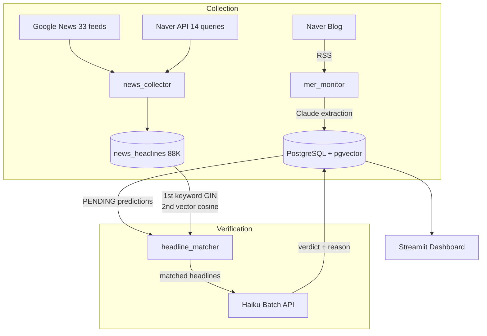

# insight-verify

[](https://github.com/11e3/insight-verify/actions/workflows/update-readme.yml)
[](https://codecov.io/gh/11e3/insight-verify)
[](https://www.python.org/downloads/)
[](LICENSE)

**How accurate are financial influencers' predictions, really?**

This system automatically extracts predictions from Korean financial blogs, then verifies them against an 88K+ news headline database. No manual labeling — fully automated extraction, matching, and verdict.

**[Live Dashboard](https://insight-verify.streamlit.app/)** · [한국어](README_KR.md) · [Experiment Log](docs/verification-experiments.md)

---

## Key Findings

| Metric | Value |
|--------|-------|
| Overall accuracy | **69.3%** (729 correct / 1,052 verified) |
| vs. headline sentiment baseline | **+14.9pp** (baseline: 54.2%) |
| Predictions tracked | 5,100 across 3 sources |
| News headline DB | 88,713 articles (2022–2026) |
| Verification cost | **$0.0045/prediction** — 87% reduction from $0.035 |
| Monthly operating cost | ~$0.50 |

We measured a **headline-sentiment baseline** on the same dataset: using keyword-matched headlines' bullish/bearish word counts to predict direction yields **54.2% accuracy** (n=1,041). The blogger beats this by **+14.9pp**, with the gap widest on bullish calls (77.8% vs 59.9%). This suggests the predictions carry genuine signal beyond what's already priced into the news cycle.

<details>
<summary><strong>Data integrity note</strong></summary>

During early batch verification, a 50-case blind audit revealed 36% contamination rate (false CORRECT verdicts from insufficient matching). All 1,047 verdicts were reset and re-verified 1-by-1 with stricter matching criteria (MIN_KEYWORD_OVERLAP=3, source_url required). Current results reflect the post-reset verified dataset.

</details>

---

## How it Works

```
Blog post → Claude extraction → structured predictions (claim, keywords, expected_date)
    → keyword GIN matching against 88K headlines → vector cosine fallback on miss
    → matched headlines + prediction → Haiku verdict → CORRECT / INCORRECT / PENDING
```



**Daily pipeline** (GitHub Actions, KST 01:00):

1. Collect new blog posts + extract insights via Claude
2. Collect news headlines (33 RSS feeds + Naver API)
3. Auto-verify (headline matching → Haiku verdict)

---

## Why is this Hard?

Korean financial blog posts contain no tickers, dates, or confidence levels. Figuring out **what counts as a prediction, when it should be verified, and what criteria determine correct vs. incorrect** — that structuring problem alone isn't solved by any off-the-shelf tool.

Automated verification is even harder. Using API web_search costs $0.035/prediction (5,000 = $175). After testing 6 different approaches, we settled on **news headline DB + keyword/vector hybrid matching + Batch API**.

<details>
<summary><strong>6 approaches compared → 87% cost reduction</strong></summary>

| Approach | Match rate | Cost/pred | Notes |
|----------|-----------|-----------|-------|
| API only (no search) | 16.9% | $0.01 | 80% PENDING — knowledge cutoff |
| API + Brave one-shot | 37.7% | $0.02 | Insufficient snippets |
| API + web_search (Sonnet) | 30% | $0.05 | Unstable |
| API + agentic tool_use (Opus) | 40% | $0.26 | Token cost explosion |
| API + web_search 1-by-1 (Haiku) | 80% | $0.035 | 5,000 preds = $175 |
| **News DB + Batch API** ★ | **prod** | **$0.0045** | **5,000 preds = ~$3** |

Details: [Experiment Log](docs/verification-experiments.md)

</details>

### Current Verification Status

| Status | Count |
|--------|-------|
| CORRECT | 729 |
| INCORRECT | 323 |
| Verifiable PENDING | 225 |
| Unverifiable (vague/conditional) | 2,793 |
| Future (awaiting expected_date) | 1,190 |

---

## Search Infrastructure

Hybrid BM25 + pgvector search retrieves relevant context from 23,963 indexed insights.

| α (BM25 weight) | Precision@5 | Recall@5 | MRR |
|----------------|-------------|----------|-----|
| 0.0 (vector) | 0.199 | 0.995 | **0.995** |
| **0.6** (prod) | **0.200** | **1.000** | 0.968 |
| 1.0 (BM25) | 0.196 | 0.980 | 0.935 |

**α=0.6** — the only setting achieving perfect Recall (1.000).

---

## Tech Stack

| Layer | Technology |
|-------|------------|
| LLM | Claude Sonnet 4.6 (extraction) / Haiku 4.5 (verification, Batch API) |
| Embeddings | `intfloat/multilingual-e5-large` (1024-dim, local) |
| DB | PostgreSQL 16 + pgvector (HNSW) |
| Search | BM25 (kiwipiepy) + pgvector → RRF fusion |
| News | Google News RSS + Naver API + feedparser |
| Scheduler | GitHub Actions cron |
| Dashboard | Streamlit Cloud |

---

## Quick Start

```bash
git clone https://github.com/11e3/insight-verify.git
cd insight-verify
cp .env.example .env  # set API keys

docker compose up -d db
python scripts/run_batch.py all        # extract insights
python -m scripts.run_job              # run pipeline once
streamlit run src/dashboard/app.py     # dashboard
```

---

## Project Structure

```
src/
├── collect/     # Data collection (blog, news RSS, Naver API)
├── extract/     # Claude insight extraction (Batch + realtime)
├── verify/      # Auto-verification (headline_matcher + auto_verifier)
├── search/      # Hybrid search (BM25 + pgvector)
├── embed/       # Embeddings (multilingual-e5-large)
├── eval/        # Search quality evaluation (ablation, LLM judge)
├── pipeline/    # Daily pipeline orchestrator
├── dashboard/   # Streamlit dashboard
└── config/      # Settings, prompts

scripts/ops/     # Batch verification, news backfill, data ops
```

---

## Cost

| Component | Cost |
|-----------|------|
| Insight extraction | ~$0.01/post |
| Auto-verification | ~$0.0045/pred |
| News collection | $0 |
| Embeddings | $0 (local) |
| **Monthly operations** | **~$0.50** |

---

## License

MIT
