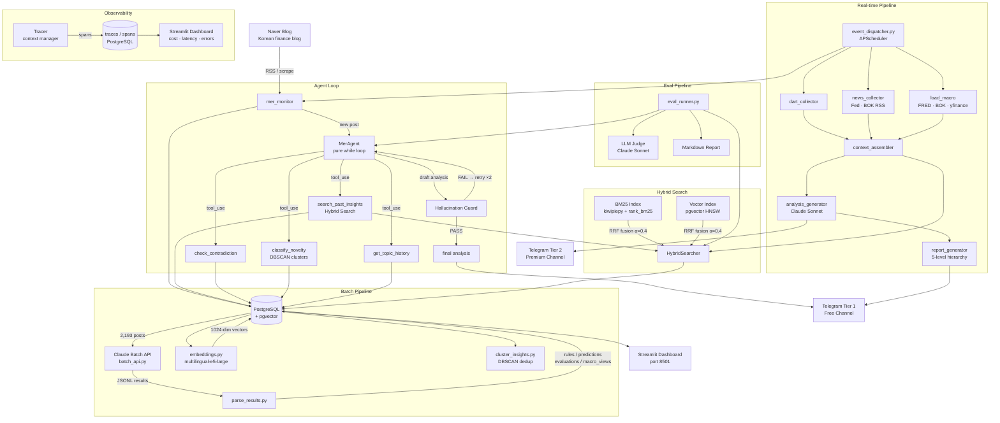

# mer-insight-pipeline

LLM Agent · Hybrid RAG · Observability pipeline for automated Korean finance blog analysis

---

## Architecture



---

## Hybrid Search — Experiment Results

BM25(키워드) + Vector(임베딩) 를 RRF로 결합하면 단일 방식 대비 retrieval 품질이 유의미하게 향상됩니다.

**골드 데이터셋**: 5개 경제 쿼리 × 관련 인사이트 5개씩, K=5

| 방식 | Precision@5 | Recall@5 | MRR |
|------|------------|---------|-----|
| Vector only | 0.52 | 0.52 | 0.90 |
| BM25 only | 0.44 | 0.44 | 0.80 |
| **Hybrid (RRF)** | **1.00** | **1.00** | **1.00** |

**왜 차이가 나는가**

- **Vector**는 "금리가 오르면 부동산이 하락" ↔ "부동산 가치는 금리와 역의 관계" 같은 의미적 패러프레이징에 강하지만, "4.6%", "30년물", "SVB" 같은 희귀 키워드는 임베딩 공간에서 희석됨
- **BM25**는 구체적 수치·고유명사를 정확히 잡지만, 동의어·문체 변화에 취약함
- **RRF**로 결합하면 두 방법이 서로 다른 인사이트를 보완해 recall이 극대화됨

```bash
python -m src.search.experiment --k 5
```

---

## Agent Loop — 왜 고정 프롬프트가 아닌가

기존 파이프라인은 MER 신규 포스트에 대해 고정된 프롬프트로 분석을 생성했습니다(`max_rules=0`).
에이전트 루프는 LLM이 **어떤 정보가 필요한지 스스로 판단**하고 tool을 순서대로 호출합니다.

```
새 포스트 수신
    → LLM: "과거 금리 관련 인사이트가 필요하다" → search_past_insights("금리 인하")
    → LLM: "이 주장이 과거 발언과 모순되는지 확인해야 한다" → check_contradiction(...)
    → LLM: "완전히 새로운 토픽인가?" → classify_novelty(...)
    → LLM: "충분한 정보 확보. 최종 분석 생성"
```

**구현 특징**
- 프레임워크 없이 순수 `while` loop + Claude `tool_use` API
- `max_iterations=5`, Hallucination Guard 실패 시 최대 2회 자동 재생성
- 실패 시 기존 `analysis_generator.py` fallback

---

## Hallucination Guard

에이전트가 생성한 분석에서 **원본 인사이트에 근거하지 않은 주장**을 자동 탐지하고 재생성을 요청합니다.

**출력 형식** (에이전트 system prompt에 지시):
```
미국 국채 금리는 하반기에 하락할 전망이에요. [ref: ins_22737, ins_16440]
이는 연준의 금리 인하 신호와 일치해요. [ref: ins_16433]
다만 인플레이션 재발 리스크도 존재해요. [ref: none]
```

**판정 기준**

| 판정 | 조건 |
|------|------|
| `GROUNDED` | `[ref: ins_ID]` 있고 원본 내용과 키워드 일치 |
| `UNGROUNDED` | ref ID가 존재하지 않거나 원본과 불일치 |
| `UNSUPPORTED` | citation 태그 자체 없음 |
| `NONE_DECLARED` | `[ref: none]` 명시 |

UNGROUNDED + UNSUPPORTED 비율 > 20% → 자동 재생성 트리거

---

## Observability

LLM 호출별 비용·latency를 PostgreSQL에 기록하고 Streamlit으로 시각화합니다.

```python
# 사용 예시
async with Tracer(conn, trace_name="agent_run") as tracer:
    resp = await tracer.call(client.messages.create, span_name="tool_step", model=..., messages=...)
```

**추적 항목**: `trace_id`, `span_id`, `model`, `input_tokens`, `output_tokens`, `latency_ms`, `cost_usd`, `tool_calls`, `error`

**토큰 가격** (claude-sonnet-4-6): input $3/1M · output $15/1M

```bash
streamlit run src/dashboard/observability.py
```

---

## Eval Pipeline

```bash
# Retrieval만 평가 (Claude 호출 없음, 빠름)
python -m src.eval.eval_runner --mode retrieval_only --k 5

# 전체 평가 (Retrieval + LLM Judge)
python -m src.eval.eval_runner --mode full --k 5
```

**평가 지표**

| 지표 | 설명 |
|------|------|
| Precision@K | 검색 결과 중 실제 관련 비율 |
| Recall@K | 관련 인사이트 중 검색으로 찾은 비율 |
| MRR | Mean Reciprocal Rank |
| Context Relevance | LLM judge: 검색 결과↔쿼리 관련성 (1–5) |
| Faithfulness | LLM judge: 분석이 원본에만 근거하는지 (hallucination 역수) |
| Answer Relevance | LLM judge: 분석이 질문에 얼마나 답하는지 |

---

## Tech Stack

| Layer | Technology |
|---|---|
| LLM | Claude Sonnet 4.6 / Haiku 4.5 (Anthropic) |
| Batch API | Anthropic Batch API |
| Embeddings | `intfloat/multilingual-e5-large` (1024 dims) |
| Vector DB | PostgreSQL 16 + pgvector (HNSW index) |
| Keyword Search | rank-bm25 + kiwipiepy (Korean morphological analysis) |
| Hybrid Fusion | Reciprocal Rank Fusion (RRF) |
| Scheduler | APScheduler 3.10 |
| Delivery | python-telegram-bot 21 |
| Data | FRED, BOK ECOS, BLS, MOLIT, DART, yfinance |
| Dashboard | Streamlit + Plotly |
| Infra | Docker Compose |

---

## Metrics

| Metric | Value |
|---|---|
| Processed posts | 2,193 |
| Extracted insights | 25,090 |
| Insight types | 4 (rule, prediction, evaluation, macro_view) |
| Embedding dimensions | 1,024 |
| BM25 index size | 16,126 canonical documents |
| Scheduled jobs | 7 |
| Report hierarchy levels | 5 |
| Macro indicators tracked | KOSPI, USD/KRW, VIX, BTC, WTI, CPI, unemployment |

---

## Setup

### Prerequisites
- Docker & Docker Compose
- Anthropic API key
- Telegram bot token (optional — for delivery)
- External API keys (FRED, BOK, BLS, MOLIT — all free)

### Quick Start

```bash
# 1. Clone and configure
git clone https://github.com/11e3/mer-insight-pipeline.git
cd mer-insight-pipeline
cp .env.example .env
# → Fill in your API keys in .env

# 2. Set up prompts
cp config/prompts.example.py config/prompts.py
# → Write your prompts in config/prompts.py

# 3. Start services
docker compose up -d db

# 4. Initialize DB schema
docker compose exec db psql -U mer -d mer_pipeline -f /docker-entrypoint-initdb.d/init_db.sql

# 5. Load posts and run batch extraction
python scripts/run_batch.py all

# 6. Build BM25 index cache
python -c "
import asyncio, asyncpg, os
from src.search.bm25_index import BM25Index
from dotenv import load_dotenv
load_dotenv()
async def build():
    conn = await asyncpg.connect(os.environ['DATABASE_URL'])
    idx = BM25Index()
    await idx.build(conn)
    idx.save('data/bm25_cache.pkl')
    await conn.close()
asyncio.run(build())
"

# 7. Start real-time dispatcher
python -m src.pipeline.event_dispatcher
```

### Observability Dashboard

```bash
streamlit run src/dashboard/observability.py
# → http://localhost:8501
```

### Run Eval

```bash
python -m src.eval.eval_runner --mode retrieval_only
python -m src.search.experiment --k 5
```

---

## Environment Variables

See [.env.example](.env.example) for all required variables.

| Variable | Description |
|---|---|
| `DATABASE_URL` | PostgreSQL connection string |
| `ANTHROPIC_API_KEY` | Claude API key |
| `TELEGRAM_BOT_TOKEN` | Telegram bot token |
| `TELEGRAM_TIER1_CHAT_ID` | Free channel chat ID |
| `TELEGRAM_TIER2_CHAT_ID` | Premium channel chat ID |
| `FRED_API_KEY` | FRED economic data (free) |
| `BOK_API_KEY` | Bank of Korea ECOS API (free) |
| `BLS_API_KEY` | US Bureau of Labor Statistics (free) |
| `MOLIT_API_KEY` | Korea real estate data / data.go.kr (free) |

---

## Project Structure

```
mer-insight-pipeline/
├── config/
│   ├── settings.py               # All configuration, loaded from .env
│   └── prompts.example.py        # Prompt structure template
├── src/
│   ├── agent/                    # LLM Agent Loop
│   │   ├── agent.py              # Pure while loop, max_iterations=5
│   │   ├── tools.py              # 5 tools (search / contradiction / novelty / history / compare)
│   │   ├── prompts.py            # System prompt with citation tagging instructions
│   │   └── state.py              # Message history & iteration state
│   ├── search/                   # Hybrid Search
│   │   ├── bm25_index.py         # BM25 with kiwipiepy tokenizer + pickle cache
│   │   ├── vector_index.py       # pgvector HNSW wrapper
│   │   ├── hybrid.py             # RRF fusion (α=0.4)
│   │   └── experiment.py         # A/B experiment: vector vs BM25 vs hybrid
│   ├── guard/                    # Hallucination Guard
│   │   ├── guard.py              # GROUNDED / UNGROUNDED / UNSUPPORTED verdict
│   │   ├── citation_tracker.py   # [ref: ins_ID] tag parser
│   │   └── self_correct.py       # Auto re-generation on FAIL (max 2 retries)
│   ├── observability/            # LLM Call Tracing
│   │   ├── tracer.py             # Tracer context manager + @trace_llm_call decorator
│   │   └── storage.py            # traces / spans PostgreSQL CRUD
│   ├── eval/                     # Eval Pipeline
│   │   ├── eval_runner.py        # Main runner (--mode retrieval_only | full)
│   │   ├── metrics.py            # Precision@K, Recall@K, MRR
│   │   ├── llm_judge.py          # Context Relevance / Faithfulness / Answer Relevance
│   │   ├── eval_dataset.py       # Gold dataset loader
│   │   └── report.py             # Markdown + JSON report generator
│   ├── extract/
│   │   ├── batch_api.py          # Claude Batch API orchestration
│   │   ├── embeddings.py         # Vector embedding generation
│   │   ├── parse_results.py      # Batch result parsing → DB
│   │   └── realtime_extractor.py
│   ├── ingest/
│   │   ├── load_posts.py
│   │   ├── load_macro.py         # FRED / BOK / yfinance
│   │   ├── load_bls.py
│   │   ├── load_realestate.py
│   │   └── load_trade.py
│   ├── pipeline/
│   │   ├── event_dispatcher.py   # Main runtime (APScheduler) + agent integration
│   │   ├── mer_monitor.py
│   │   ├── dart_collector.py
│   │   ├── news_collector.py
│   │   ├── context_assembler.py  # RAG context builder
│   │   ├── analysis_generator.py
│   │   └── report_generator.py   # 5-level hierarchy
│   ├── delivery/
│   │   ├── telegram_bot.py
│   │   └── formatters.py
│   └── dashboard/
│       ├── app.py                # Main dashboard
│       └── observability.py      # Observability dashboard
├── eval_data/
│   └── gold.json                 # Gold dataset (5 queries × 5 relevant insight IDs)
├── results/                      # Eval reports & experiment results
├── scripts/
│   ├── init_db.sql               # PostgreSQL schema (incl. traces / spans)
│   └── run_batch.py
├── docker-compose.yml
├── Dockerfile
└── requirements.txt
```

---

## License

MIT
