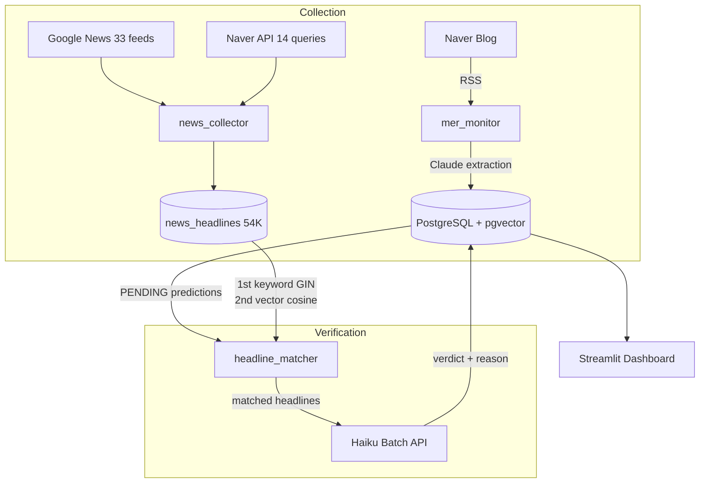

# mer-insight-pipeline

[](https://github.com/11e3/mer-insight-pipeline/actions/workflows/update-readme.yml)
[](https://codecov.io/gh/11e3/mer-insight-pipeline)
[](https://www.python.org/downloads/)
[](LICENSE)

Automatically extract predictions from financial influencers, then verify them against a news headline database.

**[Live Dashboard](https://mer-insight-pipeline.streamlit.app/)** · [한국어](README.md) · [Experiment Log](docs/verification-experiments.md)

---

### Why is this hard?

Korean financial blog posts contain no tickers, dates, or confidence levels. Figuring out **what counts as a prediction, when it should be verified, and what criteria determine correct vs. incorrect** — that structuring problem alone isn't solved by any off-the-shelf tool.

Automated verification is even harder. Using API web_search costs $0.035/prediction (5,000 = $175). After testing 6 different approaches, we settled on **news headline DB + keyword/vector hybrid matching + Batch API**, cutting costs to **$3 (87% reduction)**.

### Metrics

| | Value |
|---|---|
| Predictions tracked | 5,010 |
| Auto-verified | 669 (73.1% accuracy) |
| News headline DB | 54,461 |
| Verification cost | ~$3 (total) |
| Tests | 235, 90%+ coverage |

---

## Architecture



**Daily pipeline** (GitHub Actions, KST 01:00):

1. Collect new blog posts + extract insights via Claude
2. Collect news headlines (33 RSS feeds + Naver API)
3. Auto-verify (headline matching → Haiku verdict)

---

## Verification

The system finds relevant news articles for each prediction using a headline database, then has Haiku judge whether the prediction was correct.

```
Prediction → keyword extraction (kiwipiepy) → GIN matching → vector cosine fallback on miss
    → matched headlines + prediction → Haiku → CORRECT / INCORRECT / PENDING
```

| Item | Value |
|------|-------|
| Matching | Keyword GIN + vector cosine fallback |
| News sources | Google News RSS 33 feeds + Naver API 14 queries |
| Headlines | 54,461 (2022–2026) |
| Verdict model | Haiku 4.5 (Batch API, 50% discount) |
| Cost per prediction | $0.0045 |

Details on how we chose this approach: [Experiment Log](docs/verification-experiments.md)

### Current Status

| Status | Count |
|--------|-------|
| CORRECT | 489 |
| INCORRECT | 180 |
| Verifiable PENDING | 1,124 |
| Unverifiable (vague/conditional) | 2,187 |
| Future (awaiting expected_date) | 968 |

---

## Search Infrastructure

Hybrid BM25 + pgvector search retrieves relevant context from 25,090 indexed insights.

| α (BM25 weight) | Precision@5 | Recall@5 | MRR |
|----------------|-------------|----------|-----|
| 0.0 (vector) | 0.199 | 0.995 | **0.995** |
| **0.6** (prod) | **0.200** | **1.000** | 0.968 |
| 1.0 (BM25) | 0.196 | 0.980 | 0.935 |

**α=0.6** — the only setting achieving perfect Recall (1.000).

---

## Tech Stack

| Layer | Technology |
|-------|------------|
| LLM | Claude Sonnet 4.6 (extraction) / Haiku 4.5 (verification, Batch API) |
| Embeddings | `intfloat/multilingual-e5-large` (1024-dim, local) |
| DB | PostgreSQL 16 + pgvector (HNSW) |
| Search | BM25 (kiwipiepy) + pgvector → RRF fusion |
| News | Google News RSS + Naver API + feedparser |
| Scheduler | GitHub Actions cron |
| Dashboard | Streamlit Cloud |

---

## Quick Start

```bash
git clone https://github.com/11e3/mer-insight-pipeline.git
cd mer-insight-pipeline
cp .env.example .env  # set API keys

docker compose up -d db
python scripts/run_batch.py all        # extract insights
python -m scripts.run_job              # run pipeline once
streamlit run src/dashboard/app.py     # dashboard
```

---

## Project Structure

```
src/
├── collect/     # Data collection (blog, news RSS, Naver API)
├── extract/     # Claude insight extraction (Batch + realtime)
├── verify/      # Auto-verification (headline_matcher + auto_verifier)
├── search/      # Hybrid search (BM25 + pgvector)
├── embed/       # Embeddings (multilingual-e5-large)
├── eval/        # Search quality evaluation (ablation, LLM judge)
├── pipeline/    # Daily pipeline orchestrator
├── dashboard/   # Streamlit dashboard
└── config/      # Settings, prompts

scripts/ops/     # Batch verification, news backfill, data ops
```

---

## Cost

| Component | Cost |
|-----------|------|
| Insight extraction | ~$0.01/post |
| Auto-verification | ~$0.0045/pred |
| News collection | $0 |
| Embeddings | $0 (local) |
| **Monthly operations** | **~$0.50** |

---

## License

MIT
