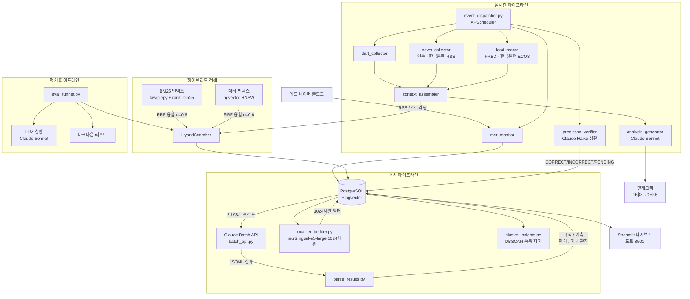

# mer-insight-pipeline

**mer-insight-pipeline**은 메르(ranto28)의 2,193개 블로그 포스트에서 금융 예측을 자동 추출·추적·검증하는 파이프라인입니다.

[메르(ranto28)](https://blog.naver.com/ranto28)는 한국 경제 블로거로, 2,193개 포스트에 걸쳐 매크로 예측을 발표합니다. 이 파이프라인은 Claude Batch API로 예측을 추출하고, 6개 외부 소스(FRED, 한국은행 ECOS, DART, 네이버 금융)에서 실제 시장 데이터를 수집하며, Claude Haiku를 자동 심판으로 활용해 매일 각 예측을 검증합니다 — 현재 5,368건의 예측을 추적 중입니다. 검색은 하이브리드 BM25 + pgvector(25,090개 인사이트, α=0.6 최적)로 구동되며, 벤더 종속 없이 PostgreSQL 위에서 동작합니다.

[](https://codecov.io/gh/11e3/mer-insight-pipeline)
[](https://mer-insight-pipeline-yvkztwypti7zbnfae8wfjs.streamlit.app)

[English README](README.md)

---

## 아키텍처



---

## 예측 자동 검증 파이프라인

메르 포스트에서 추출된 모든 `prediction` 타입 인사이트는 `mer_predictions`에 저장되고, 매일 Claude Haiku가 자동 심판을 수행합니다.

**배치당 Claude에 제공되는 컨텍스트:**

| 소스 | 내용 |
|------|------|
| 월별 매크로 요약 | KOSPI 고/저/평균, 달러/원, WTI, US10Y, Fed 금리, VIX, BTC — FRED + 한국은행 ECOS |
| 네이버 금융 주가 | 주요 10개 종목 — 과거분 월별 고/저/말일종가(H/L/C) + 최근 90일 일간 종가 |
| DART 공시 + 뉴스 | 가장 오래된 미검증 예측일 이후 수집된 기업 이벤트 |
| 자동 분석 | 동일 기간 메르 포스트 분석 내용 |

**판정 기준**

| 판정 | 조건 |
|------|------|
| `CORRECT` | 컨텍스트 또는 Claude 지식으로 예측 내용 확인됨 |
| `INCORRECT` | 근거에 의해 예측 내용이 반박됨 |
| `PENDING` | 조건 미충족 또는 정보 부족 — 다음날 재검증 |

만기 없이 결론이 날 때까지 매일 재시도합니다. 배치당 20건씩 Haiku로 처리하며, 매일 20:00 전체 미검증 예측을 검증합니다.

**실시간 정확도** (CI 푸시마다 자동 업데이트):

<!-- AUTO:prediction_accuracy -->
<!-- END:prediction_accuracy -->

---

## 매크로 데이터 파이프라인

6개 외부 소스에서 금융·경제 데이터를 스케줄에 따라 수집하여 `macro_daily` 및 `events` 테이블에 저장합니다. 예측 검증과 리포트 생성에 활용됩니다.

| 소스 | 데이터 | 스케줄 | 모듈 |
|------|--------|--------|------|
| FRED API | VIX, 미국 10년물 국채, WTI 원유, BTC/USD, Fed 기금금리, CPI YoY, 실업률 | 매시간 | `src/ingest/load_macro.py` |
| 한국은행 ECOS | 달러/원 환율, KOSPI, KOSDAQ, 기준금리 | 매시간 | `src/ingest/load_macro.py` |
| 네이버 금융 | 주요 한국 10개 종목 일간 종가 (삼성전자, SK하이닉스, 현대차, 기아, LG에너지솔루션, 포스코홀딩스, 삼성SDI, 카카오, 네이버, 셀트리온) | 검증 시 | `src/pipeline/prediction_verifier.py` |
| DART | 기업 공시 (사업보고서, 주요사항보고서, M&A 등) RSS | 매 10분, 8–18시 | `src/pipeline/dart_collector.py` |
| 연준 / 한국은행 RSS | 중앙은행 보도자료, 금리 결정, 통화정책 | 매 30분 | `src/pipeline/news_collector.py` |
| Google News | 지정학 이벤트 — 제재, 관세, 무역전쟁 키워드 | 매 30분 | `src/pipeline/news_collector.py` |

`config/settings.py`에 추가 데이터 소스용 API 키 지원: BLS (미국 노동통계), MOLIT (국토부 부동산), KOSIS (통계청 무역통계).

모든 매크로 데이터는 **예측 검증 컨텍스트**로 활용됩니다 — 월별 집계 + 최근 30일 일간 수치를 Claude Haiku에 예측 판정 근거로 제공합니다.

---

## 검색 인프라

하이브리드 BM25 + 벡터 검색은 컨텍스트 조합과 평가 파이프라인의 검색 백본으로 기능합니다.

쿼리 임베딩은 `intfloat/multilingual-e5-large` (1024-dim)을 사용합니다 — DB 인덱싱에 사용한 것과 동일한 모델. 실제 쿼리 텍스트 기반의 검색 품질을 반영합니다.

```bash
python -m src.search.experiment --mode ablation --dataset eval_data/gold_extended.json --k 5
```

**Alpha ablation** — N=200 쿼리, K=5:

<!-- AUTO:alpha_ablation -->
| α (BM25 가중치) | Precision@5 | Recall@5 | MRR |
|----------------|-------------|----------|-----|
| α=0.0 | 0.20 | 0.99 | 0.99 |
| α=0.2 | 0.20 | 0.99 | 0.99 |
| α=0.3 | 0.20 | 0.99 | 0.99 |
| α=0.4 | 0.20 | 0.99 | 0.99 |
| **α=0.6** ★ | **0.20** | **1.00** | **0.97** |
| α=0.8 | 0.20 | 0.99 | 0.96 |
| α=1.0 | 0.20 | 0.98 | 0.94 |

최적 α=0.6 — 모든 지표에서 동일 (Precision@5=0.20).

```bash
python -m src.search.experiment --mode ablation --k 5
```
<!-- END:alpha_ablation -->

임베딩: `intfloat/multilingual-e5-large` (1024-dim, DB 인덱싱과 동일 모델), N=200 쿼리.

**핵심 관찰**:
- 하이브리드(α=0.4–0.6)가 단독 방식 모두를 상회: 벡터 단독 대비 Recall +5.0%p, MRR +3.0%p
- α=0.6이 전 지표 최고 — 프로덕션 기본값 0.4보다 BM25 비중을 약간 더 주는 것이 유리
- BM25 단독(α=1.0) MRR이 순수 벡터(α=0.0)보다 높음(0.935 > 0.908): 한국 금융 텍스트에서는 티커·금리·날짜 같은 키워드 매칭이 의미 유사도보다 중요

**왜 차이가 나는가**

- **벡터**는 "금리가 오르면 부동산이 하락" ↔ "부동산 가치는 금리와 역의 관계" 같은 의미적 패러프레이징에 강하지만, "4.6%", "30년물", "SVB" 같은 희귀 키워드는 임베딩 공간에서 희석됨
- **BM25**는 구체적 수치·고유명사를 정확히 잡지만, 동의어·문체 변화에 취약함
- **RRF**로 결합하면 두 방법이 서로의 약점을 보완

---

## 평가 파이프라인

```bash
# 검색만 평가 (Claude 호출 없음, 빠름)
python -m src.eval.eval_runner --mode retrieval_only --k 5

# 전체 평가 (검색 + LLM 심판)
python -m src.eval.eval_runner --mode full --k 5
```

**검색 평가 결과** (gold\_extended.json, 200개 쿼리, K=5, 하이브리드 α=0.6):

| 지표 | 점수 |
|------|------|
| Precision@5 | 0.199 |
| Recall@5 | 0.995 |
| MRR | 0.938 |

임베딩: `intfloat/multilingual-e5-large` (DB 인덱싱과 동일 모델). 골드 데이터셋에 쿼리당 관련 문서가 1개이므로 P@5 이론 최대값 = 0.20.

**LLM 심판 지표** (Claude Sonnet, 1–5점 → 0–1 정규화):

| 지표 | 설명 |
|------|------|
| 컨텍스트 관련성 | 검색 결과↔쿼리 관련성 |
| 충실도 | 분석이 원본에만 근거하는지 (환각의 역수) |
| 답변 관련성 | 분석이 질문에 얼마나 답하는지 |

---

## 기술 스택

<!-- AUTO:tech_stack -->
| 레이어 | 기술 |
|--------|------|
| LLM (분석 · 에이전트) | `claude-sonnet-4-6` |
| LLM (추출 · 검증) | `claude-haiku-4-5-20251001` |
| 배치 API | Anthropic Batch API |
| 임베딩 | Vertex AI `text-multilingual-embedding-002` (1024차원) |
| 벡터 DB | Cloud SQL PostgreSQL 16 + pgvector (HNSW 인덱스) |
| 키워드 검색 | rank-bm25 + kiwipiepy (한국어 형태소 분석) |
| 하이브리드 융합 | Reciprocal Rank Fusion (RRF, α=0.6) |
| 스케줄러 | GCP Cloud Scheduler + Cloud Run Jobs |
| 전송 | python-telegram-bot 21 |
| 데이터 | FRED, 한국은행 ECOS, BLS, 국토부, DART, 네이버 금융 |
| 대시보드 | Streamlit (Cloud Run Service) |
| 인프라 | GCP Cloud Run Jobs + Cloud SQL |
<!-- END:tech_stack -->

---

## 주요 수치

| 지표 | 값 |
|------|-----|
| 처리된 포스트 | 2,193개 |
| 추출된 인사이트 | 25,090개 |
| 추적 중인 예측 | 5,368개 |
| 인사이트 유형 | 4가지 (규칙, 예측, 평가, 거시 관점) |
| 임베딩 차원 | 1024 |
| BM25 인덱스 크기 | 정규 문서 16,126개 |
| 스케줄된 작업 | 6개 |
| 추적 거시 지표 | KOSPI, 달러/원, WTI, VIX, BTC, US10Y, Fed 금리, CPI, 실업률 |

---

## 시작하기

### 사전 준비

**로컬 개발**
- Docker & Docker Compose
- Anthropic API 키, 텔레그램 봇 토큰

**운영 (GCP)**
- GCP 계정 + `gcloud` CLI
- 전체 설정은 [docs/gcp_setup.md](docs/gcp_setup.md) 참조

### 로컬 빠른 시작

```bash
# 1. 클론 및 설정
git clone https://github.com/11e3/mer-insight-pipeline.git
cd mer-insight-pipeline
cp .env.example .env          # API 키 입력
cp config/prompts.example.py config/prompts.py

# 2. DB 시작
docker compose up -d db

# 3. 배치 추출 (포스트 2,193개 → 인사이트 25,090개)
python scripts/run_batch.py all

# 4. BM25 인덱스 캐시 빌드
python -c "
import asyncio, asyncpg, os
from src.search.bm25_index import BM25Index
from dotenv import load_dotenv
load_dotenv()
async def build():
    conn = await asyncpg.connect(os.environ['DATABASE_URL'])
    idx = BM25Index()
    await idx.build(conn)
    idx.save('data/bm25_cache.pkl')
    await conn.close()
asyncio.run(build())
"

# 5. 단일 잡 실행 또는 상시 디스패처
python -m scripts.run_job --job mer_check
python -m src.pipeline.event_dispatcher   # 상시 실행 (로컬 전용)
```

### 운영 배포 (GCP Cloud Run)

```bash
IMAGE="asia-northeast3-docker.pkg.dev/YOUR_PROJECT/mer-pipeline/app:latest"
docker build -t $IMAGE . && docker push $IMAGE
# 전체 배포 절차: docs/gcp_setup.md 참조
```

Cloud Scheduler가 각 Cloud Run Job을 독립적으로 트리거:

| 잡 | 스케줄 |
|----|--------|
<!-- AUTO:jobs -->
| 잡 | 스케줄 |
|----|--------|
| `mer` | 매 5분마다 |
| `dart` | 매 10분, 8-18시 |
| `macro_update` | 매 1시간마다 |
| `macro_alert` | 매 30분마다 |
| `news` | 매 30분마다 |
| `verify_predictions` | 20:00 |
| `report_daily` | 21:00 |
| `report_weekly` | 매주 일요일 21:00 |
| `report_monthly` | 말일 21:00 |
| `report_quarterly` | 3/6/9/12월 말일 21:00 |
| `report_annual` | 12월 31일 21:00 |
<!-- END:jobs -->

### 예측 대시보드

```bash
streamlit run src/dashboard/prediction_dashboard.py   # http://localhost:8501
```

### 평가 실행

```bash
python -m src.eval.eval_runner --mode retrieval_only
python -m src.search.experiment --k 5
```

---

## 환경 변수

전체 변수 목록은 [.env.example](.env.example) 참조.

| 환경변수 | 설명 |
|----------|------|
| `DATABASE_URL` | PostgreSQL 연결 문자열 |
| `ANTHROPIC_API_KEY` | Claude API 키 |
| `TELEGRAM_BOT_TOKEN` | 텔레그램 봇 토큰 |
| `GCP_PROJECT_ID` | GCP 프로젝트 ID (운영) |
| `TELEGRAM_TIER1_CHAT_ID` | 텔레그램 채널 채팅 ID |
| `FRED_API_KEY` | FRED 경제 데이터 (무료) |
| `BOK_API_KEY` | 한국은행 ECOS API (무료) |
| `BLS_API_KEY` | 미국 노동통계국 (무료) |
| `MOLIT_API_KEY` | 국토부 부동산 데이터 / data.go.kr (무료) |

---

## 프로젝트 구조

```
mer-insight-pipeline/
├── config/
│   ├── settings.py               # 전체 설정 (.env에서 로드)
│   └── prompts.example.py        # 프롬프트 구조 템플릿
├── src/
│   ├── search/                   # 검색 인프라
│   │   ├── bm25_index.py         # BM25 + kiwipiepy 토크나이저 + pickle 캐시
│   │   ├── vector_index.py       # pgvector HNSW 래퍼 (1024차원)
│   │   ├── hybrid.py             # RRF 융합 (α=0.6)
│   │   └── experiment.py         # A/B 실험: 벡터 vs BM25 vs 하이브리드
│   ├── eval/                     # 평가 파이프라인
│   │   ├── eval_runner.py        # 메인 실행기 (--mode retrieval_only | full)
│   │   ├── metrics.py            # Precision@K, Recall@K, MRR
│   │   ├── llm_judge.py          # 컨텍스트 관련성 / 충실도 / 답변 관련성
│   │   ├── eval_dataset.py       # 골드 데이터셋 로더
│   │   └── report.py             # 마크다운 + JSON 리포트 생성기
│   ├── extract/
│   │   ├── batch_api.py          # Claude Batch API 오케스트레이션
│   │   ├── local_embedder.py     # multilingual-e5-large 1024차원 (기본)
│   │   ├── vertex_embedder.py    # Vertex AI 임베더 (선택, GCP_PROJECT_ID 필요)
│   │   ├── parse_results.py      # 배치 결과 파싱 → DB 저장
│   │   └── realtime_extractor.py # 실시간 인사이트 추출 (Haiku)
│   ├── ingest/
│   │   ├── load_posts.py
│   │   └── load_macro.py         # FRED / 한국은행 ECOS 매크로 데이터 수집
│   ├── pipeline/
│   │   ├── event_dispatcher.py   # 메인 런타임 (APScheduler, 6개 잡)
│   │   ├── mer_monitor.py        # 블로그 RSS 감시 (1차 데이터 소스)
│   │   ├── dart_collector.py     # DART 기업 공시
│   │   ├── news_collector.py     # RSS 피드: 연준 · 한국은행 · 지정학
│   │   ├── context_assembler.py  # RAG 컨텍스트 빌더
│   │   ├── analysis_generator.py # Claude Sonnet 포스트 분석
│   │   └── prediction_verifier.py # 매일 Claude Haiku 배치 검증
│   ├── delivery/
│   │   ├── telegram_bot.py       # 2티어 텔레그램 전송
│   │   └── formatters.py
│   └── dashboard/
│       ├── observability.py      # 비용·지연 대시보드 (로컬 참고용)
│       └── prediction_dashboard.py # 예측 적중률 대시보드
├── demo/
│   ├── app.py                    # Streamlit 데모 (API 키 불필요)
│   └── sample_data.json          # 사전 내보낸 인사이트 데이터셋
├── eval_data/
│   └── gold_extended.json        # 골드 데이터셋: 200개 쿼리 + 관련 인사이트 ID
├── results/                      # 평가 리포트 & 실험 결과
├── scripts/
│   ├── init_db.sql               # PostgreSQL 스키마
│   ├── run_batch.py              # 배치 추출 오케스트레이터
│   └── migrate_predictions.py    # 1회성: mer_insights → mer_predictions 소급 적재
├── docker-compose.yml
├── Dockerfile
└── requirements.txt
```

---

## 라이선스

MIT
