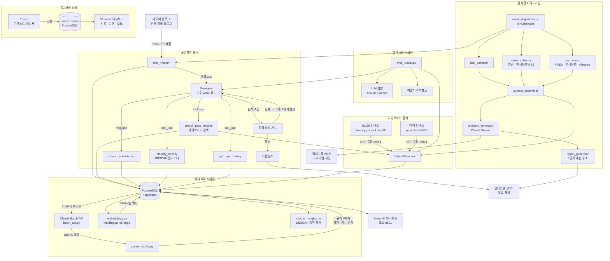

# mer-insight-pipeline

LLM 에이전트 · 하이브리드 RAG · 옵저버빌리티 파이프라인 — 한국 경제 블로그 자동 분석

[English README](README.md)

---

## 아키텍처



---

## 하이브리드 검색 — 실험 결과

BM25(키워드) + 벡터(임베딩) 를 RRF로 결합하면 단일 방식 대비 검색 품질이 유의미하게 향상됩니다.

**골드 데이터셋**: 5개 경제 쿼리 × 관련 인사이트 5개씩, K=5

| 방식 | Precision@5 | Recall@5 | MRR |
|------|------------|---------|-----|
| 벡터 단독 | 0.52 | 0.52 | 0.90 |
| BM25 단독 | 0.44 | 0.44 | 0.80 |
| **하이브리드 (RRF)** | **1.00** | **1.00** | **1.00** |

**왜 차이가 나는가**

- **벡터**는 "금리가 오르면 부동산이 하락" ↔ "부동산 가치는 금리와 역의 관계" 같은 의미적 패러프레이징에 강하지만, "4.6%", "30년물", "SVB" 같은 희귀 키워드는 임베딩 공간에서 희석됨
- **BM25**는 구체적 수치·고유명사를 정확히 잡지만, 동의어·문체 변화에 취약함
- **RRF**로 결합하면 두 방법이 서로 다른 인사이트를 보완해 재현율이 극대화됨

```bash
python -m src.search.experiment --k 5
```

---

## 에이전트 루프 — 왜 고정 프롬프트가 아닌가

기존 파이프라인은 새 포스트마다 고정된 프롬프트로 분석을 생성했습니다.
에이전트 루프는 LLM이 **어떤 정보가 필요한지 스스로 판단**하고 도구를 순서대로 호출합니다.

```
새 포스트 수신
    → LLM: "과거 금리 관련 인사이트가 필요하다" → search_past_insights("금리 인하")
    → LLM: "이 주장이 과거 발언과 모순되는지 확인해야 한다" → check_contradiction(...)
    → LLM: "완전히 새로운 토픽인가?" → classify_novelty(...)
    → LLM: "충분한 정보 확보. 최종 분석 생성"
```

**구현 특징**
- 프레임워크 없이 순수 `while` 루프 + Claude `tool_use` API
- `max_iterations=5`, 환각 방지 가드 실패 시 최대 2회 자동 재생성
- 에이전트 오류 발생 시 기존 `analysis_generator.py`로 폴백

---

## 계층형 리포트 파이프라인

단순한 요약 하나를 만드는 것이 아니라, **5단계 계층 구조**로 리포트를 생성합니다. 각 단계의 출력이 다음 단계의 원재료가 됩니다.

```
연간 (1월 1일)          ← 분기 리포트 4개를 합성   (Claude 2회)
  └─ 분기 (분기 첫날)   ← 월간 리포트 3개를 합성
       └─ 월간 (매월 1일) ← 주간 리포트 4개를 합성
            └─ 주간 (월요일 08:00) ← 일간 리포트 7개를 합성
                 └─ 일간 (매일 21:00) ← 그날 에이전트 분석들을 요약
```

**왜 계층 구조인가**

각 단계는 **하위 단계에서는 보이지 않는 패턴**을 찾도록 지시받습니다. 단순 나열·복붙은 금지입니다.

```
주간  → "이번 주 글들을 관통하는 흐름은?"
월간  → "주 단위에서는 안 보이던 구조적 변화는?"
연간  → "올해를 정의하는 두 가지 키워드는?"
```

하위 리포트가 없을 때(조용한 날 일간 리포트가 없는 경우 등)는 매크로 원시 데이터(KOSPI, 금리, VIX, 무역수지)를 직접 받아 코멘터리를 생성하는 것으로 폴백합니다.

**프롬프트 설계 — `_synthesis` vs `_commentary`**

| 모드 | 입력 | 지시 |
|------|------|------|
| `_commentary` | 매크로 수치 원본 | [COMMENTARY] 슬롯 채우기 — 수치 조작 금지 |
| `_synthesis` | 하위 리포트(텍스트) | 상위 레벨 연결고리 발견 — 복붙·나열 금지 |

---

## 환각 방지 가드

에이전트가 생성한 분석에서 **원본 인사이트에 근거하지 않은 주장**을 자동 탐지하고 재생성을 요청합니다.

**출력 형식** (에이전트 시스템 프롬프트에 지시):
```
미국 국채 금리는 하반기에 하락할 전망이에요. [ref: ins_22737, ins_16440]
이는 연준의 금리 인하 신호와 일치해요. [ref: ins_16433]
다만 인플레이션 재발 리스크도 존재해요. [ref: none]
```

**판정 기준**

| 판정 | 조건 |
|------|------|
| `GROUNDED` | `[ref: ins_ID]` 있고 원본 내용과 키워드 일치 |
| `UNGROUNDED` | ref ID가 존재하지 않거나 원본과 불일치 |
| `UNSUPPORTED` | citation 태그 자체 없음 |
| `NONE_DECLARED` | `[ref: none]` 명시 |

UNGROUNDED + UNSUPPORTED 비율 > 20% → 자동 재생성 트리거

---

## 옵저버빌리티

LLM 호출별 비용·지연 시간을 PostgreSQL에 기록하고 Streamlit으로 시각화합니다.

```python
# 사용 예시
async with Tracer(conn, trace_name="agent_run") as tracer:
    resp = await tracer.call(client.messages.create, span_name="tool_step", model=..., messages=...)
```

**추적 항목**: `trace_id`, `span_id`, `model`, `input_tokens`, `output_tokens`, `latency_ms`, `cost_usd`, `tool_calls`, `error`

**토큰 가격** (claude-sonnet-4-6): 입력 $3/1M · 출력 $15/1M

```bash
streamlit run src/dashboard/observability.py
```

---

## 평가 파이프라인

```bash
# 검색만 평가 (Claude 호출 없음, 빠름)
python -m src.eval.eval_runner --mode retrieval_only --k 5

# 전체 평가 (검색 + LLM 심판)
python -m src.eval.eval_runner --mode full --k 5
```

**평가 지표**

| 지표 | 설명 |
|------|------|
| Precision@K | 검색 결과 중 실제 관련 비율 |
| Recall@K | 관련 인사이트 중 검색으로 찾은 비율 |
| MRR | 평균 역순위 (Mean Reciprocal Rank) |
| 컨텍스트 관련성 | LLM 심판: 검색 결과↔쿼리 관련성 (1–5점) |
| 충실도 | LLM 심판: 분석이 원본에만 근거하는지 (환각의 역수) |
| 답변 관련성 | LLM 심판: 분석이 질문에 얼마나 답하는지 (1–5점) |

---

## 기술 스택

| 레이어 | 기술 |
|--------|------|
| LLM | Claude Sonnet 4.6 / Haiku 4.5 (Anthropic) |
| 배치 API | Anthropic Batch API |
| 임베딩 | `intfloat/multilingual-e5-large` (1024차원) |
| 벡터 DB | PostgreSQL 16 + pgvector (HNSW 인덱스) |
| 키워드 검색 | rank-bm25 + kiwipiepy (한국어 형태소 분석) |
| 하이브리드 융합 | Reciprocal Rank Fusion (RRF) |
| 스케줄러 | APScheduler 3.10 |
| 전송 | python-telegram-bot 21 |
| 데이터 | FRED, 한국은행 ECOS, BLS, 국토부, DART, yfinance |
| 대시보드 | Streamlit + Plotly |
| 인프라 | Docker Compose |

---

## 주요 수치

| 지표 | 값 |
|------|-----|
| 처리된 포스트 | 2,193개 |
| 추출된 인사이트 | 25,090개 |
| 인사이트 유형 | 4가지 (규칙, 예측, 평가, 거시 관점) |
| 임베딩 차원 | 1,024 |
| BM25 인덱스 크기 | 정규 문서 16,126개 |
| 스케줄된 작업 | 7개 |
| 리포트 계층 단계 | 5단계 |
| 추적 거시 지표 | KOSPI, 달러/원, VIX, BTC, WTI, CPI, 실업률 |

---

## 시작하기

### 사전 준비
- Docker & Docker Compose
- Anthropic API 키
- 텔레그램 봇 토큰 (선택 — 전송 기능 사용 시)
- 외부 API 키 (FRED, 한국은행, BLS, 국토부 — 모두 무료)

### 빠른 시작

```bash
# 1. 클론 및 설정
git clone https://github.com/11e3/mer-insight-pipeline.git
cd mer-insight-pipeline
cp .env.example .env
# → .env 파일에 API 키 입력

# 2. 프롬프트 설정
cp config/prompts.example.py config/prompts.py
# → config/prompts.py에 프롬프트 작성

# 3. 서비스 시작
docker compose up -d db

# 4. DB 스키마 초기화
docker compose exec db psql -U mer -d mer_pipeline -f /docker-entrypoint-initdb.d/init_db.sql

# 5. 포스트 로드 및 배치 추출 실행
python scripts/run_batch.py all

# 6. BM25 인덱스 캐시 빌드
python -c "
import asyncio, asyncpg, os
from src.search.bm25_index import BM25Index
from dotenv import load_dotenv
load_dotenv()
async def build():
    conn = await asyncpg.connect(os.environ['DATABASE_URL'])
    idx = BM25Index()
    await idx.build(conn)
    idx.save('data/bm25_cache.pkl')
    await conn.close()
asyncio.run(build())
"

# 7. 실시간 디스패처 시작
python -m src.pipeline.event_dispatcher
```

### 옵저버빌리티 대시보드

```bash
streamlit run src/dashboard/observability.py
# → http://localhost:8501
```

### 평가 실행

```bash
python -m src.eval.eval_runner --mode retrieval_only
python -m src.search.experiment --k 5
```

---

## 환경 변수

전체 변수 목록은 [.env.example](.env.example) 참조.

| 환경변수 | 설명 |
|----------|------|
| `DATABASE_URL` | PostgreSQL 연결 문자열 |
| `ANTHROPIC_API_KEY` | Claude API 키 |
| `TELEGRAM_BOT_TOKEN` | 텔레그램 봇 토큰 |
| `TELEGRAM_TIER1_CHAT_ID` | 무료 채널 채팅 ID |
| `TELEGRAM_TIER2_CHAT_ID` | 프리미엄 채널 채팅 ID |
| `FRED_API_KEY` | FRED 경제 데이터 (무료) |
| `BOK_API_KEY` | 한국은행 ECOS API (무료) |
| `BLS_API_KEY` | 미국 노동통계국 (무료) |
| `MOLIT_API_KEY` | 국토부 부동산 데이터 / data.go.kr (무료) |

---

## 프로젝트 구조

```
mer-insight-pipeline/
├── config/
│   ├── settings.py               # 전체 설정 (.env에서 로드)
│   └── prompts.example.py        # 프롬프트 구조 템플릿
├── src/
│   ├── agent/                    # LLM 에이전트 루프
│   │   ├── agent.py              # 순수 while 루프, max_iterations=5
│   │   ├── tools.py              # 5개 도구 (검색 / 모순 / 신규성 / 이력 / 비교)
│   │   ├── prompts.py            # citation 태깅 지시 포함 시스템 프롬프트
│   │   └── state.py              # 메시지 이력 & 반복 상태
│   ├── search/                   # 하이브리드 검색
│   │   ├── bm25_index.py         # BM25 + kiwipiepy 토크나이저 + pickle 캐시
│   │   ├── vector_index.py       # pgvector HNSW 래퍼
│   │   ├── hybrid.py             # RRF 융합 (α=0.4)
│   │   └── experiment.py         # A/B 실험: 벡터 vs BM25 vs 하이브리드
│   ├── guard/                    # 환각 방지 가드
│   │   ├── guard.py              # GROUNDED / UNGROUNDED / UNSUPPORTED 판정
│   │   ├── citation_tracker.py   # [ref: ins_ID] 태그 파서
│   │   └── self_correct.py       # 실패 시 자동 재생성 (최대 2회)
│   ├── observability/            # LLM 호출 추적
│   │   ├── tracer.py             # Tracer 컨텍스트 매니저 + @trace_llm_call 데코레이터
│   │   └── storage.py            # traces / spans PostgreSQL CRUD
│   ├── eval/                     # 평가 파이프라인
│   │   ├── eval_runner.py        # 메인 실행기 (--mode retrieval_only | full)
│   │   ├── metrics.py            # Precision@K, Recall@K, MRR
│   │   ├── llm_judge.py          # 컨텍스트 관련성 / 충실도 / 답변 관련성
│   │   ├── eval_dataset.py       # 골드 데이터셋 로더
│   │   └── report.py             # 마크다운 + JSON 리포트 생성기
│   ├── extract/
│   │   ├── batch_api.py          # Claude Batch API 오케스트레이션
│   │   ├── embeddings.py         # 벡터 임베딩 생성
│   │   ├── parse_results.py      # 배치 결과 파싱 → DB 저장
│   │   └── realtime_extractor.py
│   ├── ingest/
│   │   ├── load_posts.py
│   │   ├── load_macro.py         # FRED / 한국은행 / yfinance
│   │   ├── load_bls.py
│   │   ├── load_realestate.py
│   │   └── load_trade.py
│   ├── pipeline/
│   │   ├── event_dispatcher.py   # 메인 런타임 (APScheduler) + 에이전트 연동
│   │   ├── mer_monitor.py        # 블로그 RSS 감시
│   │   ├── dart_collector.py     # DART 공시 (한국 증권거래소)
│   │   ├── news_collector.py     # RSS 피드: 연준 · 한국은행 · 지정학
│   │   ├── context_assembler.py  # RAG 컨텍스트 빌더
│   │   ├── analysis_generator.py # Claude 분석 생성
│   │   └── report_generator.py   # 5단계 계층적 합성
│   ├── delivery/
│   │   ├── telegram_bot.py       # 2티어 텔레그램 전송
│   │   └── formatters.py
│   └── dashboard/
│       ├── app.py                # 메인 대시보드
│       └── observability.py      # LLM 비용 / 지연 / 오류 대시보드
├── eval_data/
│   └── gold.json                 # 골드 데이터셋: 5개 쿼리 × 관련 인사이트 ID 5개씩
├── results/                      # 평가 리포트 & 실험 결과
├── scripts/
│   ├── init_db.sql               # PostgreSQL 스키마 (traces / spans 포함)
│   └── run_batch.py
├── docker-compose.yml
├── Dockerfile
└── requirements.txt
```

---

## 라이선스

MIT
