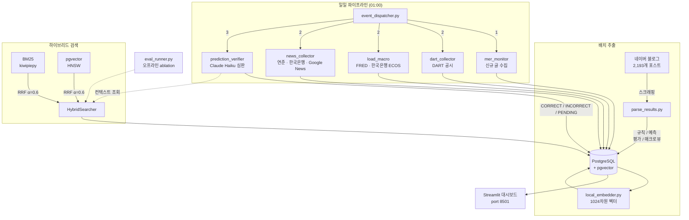

# mer-insight-pipeline

**mer-insight-pipeline**은 [메르(ranto28)](https://blog.naver.com/ranto28)의 2,193개 한국 경제 블로그 포스트에서 금융 예측을 자동으로 추적하고 검증하는 파이프라인입니다. FRED, 한국은행 ECOS, DART, 네이버 금융, 연준/한국은행 RSS, Google News 등 6개 외부 소스의 매크로 데이터를 활용합니다.

Claude Batch API로 예측을 추출하고, 실시간 시장 데이터를 수집하며, Claude Haiku가 자동 심판으로 매일 각 예측을 검증합니다 — 현재 5,010건 추적 중. 검색은 PostgreSQL 기반 하이브리드 BM25 + pgvector (25,090개 인덱싱된 인사이트, RRF 융합 α=0.6)로 벡터 DB 벤더 종속 없이 구현했습니다.

[](https://github.com/11e3/mer-insight-pipeline/actions)
[](http://34.50.19.176:8501)

[English README](README.md)

---

## 아키텍처



---

## 예측 검증 파이프라인

메르 포스트에서 추출된 모든 `prediction` 타입 인사이트는 `mer_predictions`에 저장되고, 매일 Claude Haiku가 자동 심판으로 검증합니다.

아래 데이터 소스에서 매일 수집한 데이터를 Claude에 검증 컨텍스트로 제공합니다.

**판정 기준**

| 판정 | 조건 |
|------|------|
| `CORRECT` | 컨텍스트 또는 Claude 지식으로 예측 내용이 확인됨 |
| `INCORRECT` | 근거에 의해 예측 내용이 반박됨 |
| `PENDING` | 조건 미충족 또는 정보 부족 — 다음날 재검증 |

만기 없이 확정될 때까지 큐에 유지. `BATCH_SIZE=40` 예측을 Haiku에 전달하며, **프롬프트 캐싱** 적용 (캐시된 컨텍스트 input 비용 ~90% 절감).

---

## 매크로 데이터 파이프라인

| 소스 | 데이터 |
|------|--------|
| FRED API | VIX, 미국 10년물 국채, WTI 원유, BTC/USD, 기준금리, CPI YoY, 실업률 |
| 한국은행 ECOS | USD/KRW, KOSPI, KOSDAQ, 한국 기준금리 |
| 네이버 금융 | 주요 한국 주식 10종목 월별 고/저/종가 + 최신 종가 |
| DART | 기업 공시 (사업보고서, 주요사항보고서 등) RSS |
| 연준 / 한국은행 RSS | 중앙은행 보도자료, 금리 결정 |
| Google News | 지정학 이벤트 — 제재, 관세, 무역전쟁 키워드 |

모든 데이터는 매일 예측 검증 직전에 1회 수집되어 Claude Haiku의 판정 근거로 제공됩니다.

---

## 검색 인프라

하이브리드 BM25 + 벡터 검색이 컨텍스트 조립과 평가 파이프라인의 검색 백본입니다.

쿼리 임베딩은 `intfloat/multilingual-e5-large` (1024차원) — 프로덕션 DB 인덱싱에 사용된 동일 모델.

**알파 ablation** — N=200 쿼리, K=5:

| α (BM25 가중치) | Precision@5 | Recall@5 | MRR |
|----------------|-------------|----------|-----|
| **α=0.0** | 0.199 | 0.995 | **0.995** |
| **α=0.6** ★ | **0.200** | **1.000** | 0.968 |
| α=1.0 | 0.196 | 0.980 | 0.935 |

프로덕션 기본값: **α=0.6** — 완전한 Recall(1.000)을 달성하는 유일한 설정.

---

## 기술 스택

| 레이어 | 기술 |
|--------|------|
| LLM (분석 · 검증) | `claude-sonnet-4-6` |
| LLM (추출, 기본) | `claude-sonnet-4-6` (Haiku 선택 가능: `--haiku`) |
| 배치 API | Anthropic Batch API |
| 임베딩 | `intfloat/multilingual-e5-large` (1024차원, 로컬) |
| 벡터 DB | PostgreSQL 16 + pgvector (HNSW 인덱스) |
| 키워드 검색 | rank-bm25 + kiwipiepy (한국어 형태소 분석) |
| 하이브리드 융합 | Reciprocal Rank Fusion (RRF, α=0.6) |
| 스케줄러 | APScheduler (로컬) / GCP Cloud Scheduler + Cloud Run Job |
| 데이터 소스 | FRED, BOK ECOS, DART, 네이버 금융, 연준/한국은행 RSS, Google News |
| 대시보드 | Streamlit |

---

## 지표

| 지표 | 값 |
|------|---|
| 처리된 포스트 | 2,193개 |
| 추출된 인사이트 | 25,090개 |
| 추적 중인 예측 | 5,010건 |
| 인사이트 유형 | 4가지 (rule, prediction, evaluation, macro_view) |
| 임베딩 차원 | 1024 |
| BM25 인덱스 크기 | 19,702개 문서 |

---

## 설치

### 사전 요구사항

- Docker & Docker Compose
- Anthropic API 키

### 빠른 시작

```bash
# 1. 클론 및 설정
git clone https://github.com/11e3/mer-insight-pipeline.git
cd mer-insight-pipeline
cp .env.example .env        # API 키 입력
cp config/prompts.example.py config/prompts.py

# 2. 데이터베이스 시작
docker compose up -d db

# 3. 배치 추출 실행 (2,193 포스트 → 25,090 인사이트)
python scripts/run_batch.py all

# 4. BM25 인덱스 캐시 빌드
python -m src.search.bm25_index

# 5. 파이프라인 1회 실행 또는 일일 스케줄러 시작
python -m scripts.run_job                 # 1회 실행
python -m src.pipeline.event_dispatcher   # 매일 01:00 스케줄러
```

### 일일 파이프라인

매일 01:00 (KST) Cloud Scheduler 또는 APScheduler로 실행:

1. 메르 블로그 — 신규 글 확인, 예측 추출
2. DART / FRED / 한국은행 ECOS / 뉴스 RSS — 최신 데이터 수집
3. 예측 검증 — Claude Haiku가 모든 미검증 예측 판정

### 대시보드

```bash
streamlit run src/dashboard/prediction_dashboard.py   # http://localhost:8501
```

### 평가

```bash
python -m src.eval.eval_runner --mode retrieval_only
python -m src.search.experiment --mode ablation --k 5
```

---

## 환경 변수

| 변수 | 필수 | 설명 |
|------|------|------|
| `DATABASE_URL` | ✓ | PostgreSQL 연결 문자열 |
| `ANTHROPIC_API_KEY` | ✓ | Claude API 키 |
| `GCP_PROJECT_ID` | 선택 | GCP 프로젝트 ID (Vertex AI 임베딩용) |
| `GCP_LOCATION` | 선택 | Vertex AI 리전 (기본: us-central1) |
| `FRED_API_KEY` | 선택 | FRED 거시경제 데이터 (무료) |
| `BOK_API_KEY` | 선택 | 한국은행 ECOS API (무료) |

---

## 프로젝트 구조

```
mer-insight-pipeline/
├── config/
│   ├── settings.py               # 전체 설정, .env에서 로드
│   └── prompts.example.py        # 프롬프트 구조 템플릿
├── src/
│   ├── search/                   # 검색 인프라
│   │   ├── bm25_index.py         # kiwipiepy 토크나이저 + pickle 캐시
│   │   ├── vector_index.py       # pgvector HNSW 래퍼 (1024차원)
│   │   ├── hybrid.py             # RRF 융합 (α=0.6)
│   │   └── experiment.py         # Ablation: 벡터 vs BM25 vs 하이브리드
│   ├── eval/                     # 평가 파이프라인
│   │   ├── eval_runner.py        # 메인 러너 (--mode retrieval_only | full)
│   │   ├── metrics.py            # Precision@K, Recall@K, MRR
│   │   ├── llm_judge.py          # Context Relevance / Faithfulness / Answer Relevance
│   │   └── report.py             # 마크다운 + JSON 리포트 생성기
│   ├── extract/
│   │   ├── batch_api.py          # Claude Batch API 오케스트레이션
│   │   ├── embedder.py           # Embedder 프로토콜 + 팩토리 (LocalEmbedder 기본)
│   │   ├── local_embedder.py     # multilingual-e5-large 1024차원
│   │   ├── parse_results.py      # 배치 결과 파싱 → DB
│   │   └── realtime_extractor.py # 실시간 인사이트 추출 (Haiku)
│   ├── ingest/
│   │   ├── load_macro.py         # FRED / 한국은행 ECOS 매크로 데이터 수집
│   │   └── date_parser.py        # 한국어 날짜 문자열 파서
│   ├── pipeline/
│   │   ├── event_dispatcher.py   # 메인 런타임 (APScheduler, 6개 스케줄)
│   │   ├── mer_monitor.py        # 블로그 RSS 감시
│   │   ├── dart_collector.py     # DART 공시 (한국 기업 공시)
│   │   ├── news_collector.py     # RSS 피드: 연준 · 한국은행 · 지정학
│   │   └── prediction_verifier.py # 일일 Claude Haiku 배치 검증
│   └── dashboard/
│       └── prediction_dashboard.py # 예측 적중률 대시보드
├── app.py                        # Streamlit Cloud 진입점
├── eval_data/
│   └── gold_extended.json        # 골드 데이터셋: 200개 쿼리 + 관련 인사이트 ID
├── scripts/
│   ├── init_db.sql               # PostgreSQL 스키마
│   ├── run_batch.py              # 배치 추출 오케스트레이터
│   ├── run_job.py                # 파이프라인 진입점 (일일 1회 실행)
│   └── migrate_predictions.py    # 일회성: mer_insights → mer_predictions 소급 적재
├── docker-compose.yml
├── Dockerfile
└── requirements.txt
```

---

## 라이선스

MIT
