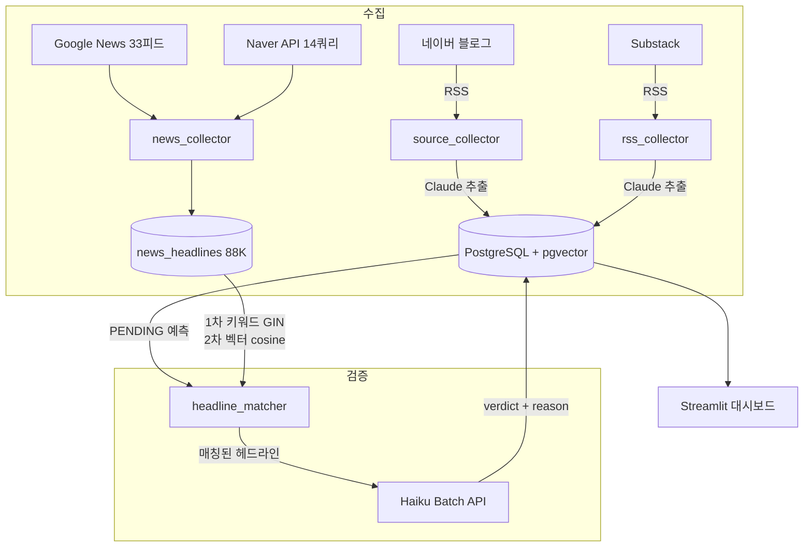

# insight-verify

[](https://github.com/11e3/insight-verify/actions/workflows/update-readme.yml)
[](https://codecov.io/gh/11e3/insight-verify)
[](https://www.python.org/downloads/)
[](LICENSE)

**금융 인플루언서의 예측은 실제로 얼마나 맞을까?**

한국어/영어 금융 블로그·뉴스레터에서 예측을 자동 추출하고, 88K+ 뉴스 헤드라인 DB로 검증하는 파이프라인. 수동 라벨링 없이 추출·매칭·판정까지 완전 자동화.

**[라이브 대시보드](https://insight-verify.streamlit.app/)** · [English](README.md) · [실험 기록](docs/verification-experiments.md)

---

## 주요 발견

| 지표 | 값 |
|------|-----|
| 전체 적중률 | **69.2%** (731건 정답 / 1,056건 검증) |
| vs. 헤드라인 센티먼트 baseline | **+14.9pp** (baseline: 54.2%) |
| 추적 중인 예측 | 5,180건 (3개 소스) |
| 뉴스 헤드라인 DB | 88,713건 (2022–2026, 한국어 + 영어) |
| 검증 비용 | **건당 $0.0045** — $0.035에서 87% 절감 |
| 월 운영비 | ~$0.50 |

동일 데이터셋에서 **헤드라인 센티먼트 baseline**을 실측: 키워드 매칭된 헤드라인의 긍정/부정 단어 수로 방향을 예측하면 **54.2%** (n=1,041). 블로거는 이보다 **+14.9pp** 높으며, 상승 예측에서 격차가 가장 큼 (77.8% vs 59.9%). 뉴스에 이미 반영된 정보 이상의 시그널이 있음을 시사.

### 소스 리더보드

| 소스 | 예측 | 검증 | 적중률 |
|------|------|------|--------|
| mer_ranto28 (한국 매크로 블로그) | 5,010 | 1,052 | **69.3%** |
| arthur_hayes (Crypto Trader Digest) | 150 | 4 | 50.0%* |

\* Hayes 검증 진행 중 — 대부분 장기 예측(2026–2028). 66건이 헤드라인과 매칭됐으나 근거 부족으로 PENDING 판정. expected_date가 지나면서 검증 건수가 누적될 예정.

<details>
<summary><strong>데이터 무결성 노트</strong></summary>

초기 배치 검증에서 50건 블라인드 감사 결과 36% 오염률(매칭 부족으로 인한 false CORRECT) 확인. 전체 1,047건 verdict 리셋 후 엄격한 기준(MIN_KEYWORD_OVERLAP=3, source_url 필수)으로 1건씩 재검증. 현재 결과는 리셋 후 데이터.

</details>

---

## 동작 원리

```
블로그/뉴스레터 → Claude 추출 → 구조화된 예측 (claim, keywords, expected_date)
    → 88K 헤드라인 대상 키워드 GIN 매칭 → 실패 시 벡터 cosine fallback
    → 매칭된 헤드라인 + 예측 → Haiku 판정 → CORRECT / INCORRECT / PENDING
```



**일일 파이프라인** (GitHub Actions, KST 01:00):

1. 활성 소스에서 신규 글 수집 + Claude 인사이트 추출
2. 뉴스 헤드라인 수집 (RSS 33피드 + Naver API)
3. 자동 검증 (헤드라인 매칭 → Haiku 판정)

---

## 왜 이게 어려운가?

금융 블로그에는 종목 코드도, 날짜도, 확신도도 없습니다. "유가가 오를 것이다"라는 문장에서 **무엇이 예측이고, 언제까지 검증해야 하고, 뭘 기준으로 맞다/틀리다를 판단하는지** — 이 구조화 자체가 기성 도구로 해결 안 되는 NLP 문제입니다.

자동 검증은 더 어렵습니다. API web_search로 1건씩 검증하면 5,000건에 175달러. 6가지 방식을 실험한 끝에 뉴스 헤드라인 DB + 키워드/벡터 하이브리드 매칭 + Batch API로 비용을 **3달러로 87% 절감**했습니다.

<details>
<summary><strong>6가지 방식 비교 → 87% 비용 절감</strong></summary>

| 방식 | 일치율 | 비용/건 | 비고 |
|------|--------|---------|------|
| API만 (검색 없음) | 16.9% | $0.01 | 80% PENDING — knowledge cutoff |
| API + Brave 원샷 검색 | 37.7% | $0.02 | snippet 불충분 |
| API + web_search (Sonnet) | 30% | $0.05 | 불안정 |
| API + 에이전틱 tool_use (Opus) | 40% | $0.26 | 토큰 누적 비용 폭발 |
| API + web_search 1건씩 (Haiku) | 80% | $0.035 | 5,000건 = $175 |
| **뉴스 DB + Batch API** ★ | **실전** | **$0.0045** | **5,000건 = ~$3** |

자세한 내용: [실험 기록](docs/verification-experiments.md)

</details>

### 현재 검증 현황

| 상태 | 건수 |
|------|------|
| CORRECT | 731 |
| INCORRECT | 325 |
| 검증 대기 (PENDING) | 225 |
| 검증 불가 (모호/조건부) | 2,793 |
| 미래 대기 (expected_date 미도래) | 1,203 |

---

## 검색 인프라

하이브리드 BM25 + pgvector 검색으로 24,385개 인사이트에서 관련 문맥을 검색합니다.

| α (BM25 가중치) | Precision@5 | Recall@5 | MRR |
|----------------|-------------|----------|-----|
| 0.0 (vector) | 0.199 | 0.995 | **0.995** |
| **0.6** (prod) | **0.200** | **1.000** | 0.968 |
| 1.0 (BM25) | 0.196 | 0.980 | 0.935 |

**α=0.6** — Recall 1.000을 달성하는 유일한 설정.

---

## 기술 스택

| 레이어 | 기술 |
|--------|------|
| LLM | Claude Sonnet 4.6 (추출) / Haiku 4.5 (검증, Batch API) |
| 임베딩 | `intfloat/multilingual-e5-large` (1024차원, 로컬) |
| DB | PostgreSQL 16 + pgvector (HNSW) |
| 검색 | BM25 (kiwipiepy) + pgvector → RRF 융합 |
| 뉴스 | Google News RSS + Naver API + feedparser |
| NLP | kiwipiepy (한국어 형태소) + 복합 명사구 추출 (영어) |
| 스케줄러 | GitHub Actions cron |
| 대시보드 | Streamlit Cloud |

---

## 빠른 시작

```bash
git clone https://github.com/11e3/insight-verify.git
cd insight-verify
cp .env.example .env  # API 키 설정

docker compose up -d db
python scripts/run_batch.py all        # 인사이트 추출
python -m scripts.run_job              # 파이프라인 1회 실행
streamlit run src/dashboard/app.py     # 대시보드
```

---

## 프로젝트 구조

```
src/
├── collect/     # 데이터 수집 (블로그, Substack RSS, 뉴스)
├── extract/     # Claude 인사이트 추출 (Batch + 실시간)
├── verify/      # 자동 검증 (headline_matcher + auto_verifier)
├── search/      # 하이브리드 검색 (BM25 + pgvector)
├── embed/       # 임베딩 (multilingual-e5-large)
├── eval/        # 검색 품질 평가 (ablation, LLM judge)
├── pipeline/    # 일일 파이프라인 오케스트레이터
├── dashboard/   # Streamlit 대시보드
└── config/      # 설정, 프롬프트 (한국어 + 영어)

scripts/ops/     # 배치 검증, 뉴스 백필, Substack 백필, 데이터 운영
```

---

## 비용

| 항목 | 비용 |
|------|------|
| 인사이트 추출 | ~$0.01/글 |
| 자동 검증 | ~$0.0045/건 |
| 뉴스 수집 | $0 |
| 임베딩 | $0 (로컬) |
| **월 운영** | **~$0.50** |

---

## 라이선스

MIT
