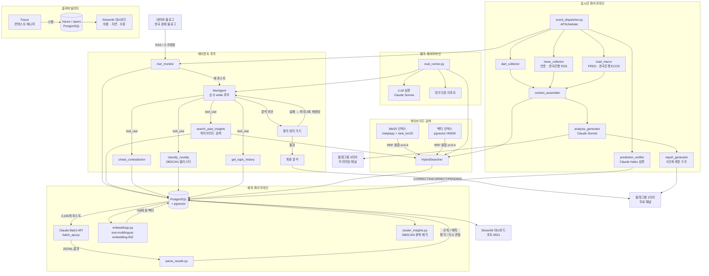

# mer-insight-pipeline

**mer-insight-pipeline**은 [메르(ranto28) 한국 경제 블로그](https://blog.naver.com/ranto28)를 모니터링하고, Claude Batch API로 포스트 2,193개에서 인사이트를 추출하며, 새 글이 올라오면 수분 내에 인용 근거가 명시된 분석을 텔레그램 구독자에게 전송합니다.

모든 컴포넌트가 실운영 수준으로 연결됩니다: 25,090개 인사이트를 인덱싱한 하이브리드 검색, 스스로 도구 호출을 결정하는 LLM 에이전트 루프, 미인용 주장을 차단하는 환각 방지 가드, Claude Haiku를 심판으로 사용하는 예측 자동 검증 파이프라인(5,368개 추적 중), 호출별 비용·지연 추적, LLM 심판을 포함한 평가 파이프라인 — 모두 벤더 종속 없이 PostgreSQL + pgvector 위에서 동작합니다.

**포스트당 약 $0.15** (평균 4 iteration) · **월 30개 기준 약 $4.50**

[English README](README.md)

---

## 아키텍처



---

## 하이브리드 검색 — 실험 결과

BM25(키워드) + 벡터(임베딩)를 RRF로 결합하면 단일 방식 대비 검색 품질이 유의미하게 향상됩니다.

**골드 데이터셋**: 5개 경제 쿼리 × 관련 인사이트 5개씩, K=5

| 방식 | Precision@5 | Recall@5 | MRR |
|------|------------|---------|-----|
| 벡터 단독 | 0.52 | 0.52 | 0.90 |
| BM25 단독 | 0.44 | 0.44 | 0.80 |
| **하이브리드 (RRF)** | **1.00** | **1.00** | **1.00** |

paired t-test: t=4.707, **p=0.0093** (통계적으로 유의)

**왜 차이가 나는가**

- **벡터**는 "금리가 오르면 부동산이 하락" ↔ "부동산 가치는 금리와 역의 관계" 같은 의미적 패러프레이징에 강하지만, "4.6%", "30년물", "SVB" 같은 희귀 키워드는 임베딩 공간에서 희석됨
- **BM25**는 구체적 수치·고유명사를 정확히 잡지만, 동의어·문체 변화에 취약함
- **RRF**로 결합하면 두 방법이 서로 다른 인사이트를 보완해 재현율이 극대화됨

```bash
python -m src.search.experiment --k 5
```

---

## 에이전트 루프 — 왜 고정 프롬프트가 아닌가

기존 파이프라인은 새 포스트마다 고정된 프롬프트로 분석을 생성했습니다.
에이전트 루프는 LLM이 **어떤 정보가 필요한지 스스로 판단**하고 도구를 순서대로 호출합니다.

```
새 포스트 수신
    → LLM: "과거 금리 관련 인사이트가 필요하다" → search_past_insights("금리 인하")
    → LLM: "이 주장이 과거 발언과 모순되는지 확인해야 한다" → check_contradiction(...)
    → LLM: "완전히 새로운 토픽인가?" → classify_novelty(...)
    → LLM: "충분한 정보 확보. 최종 분석 생성"
```

**구현 특징**
- 프레임워크 없이 순수 `while` 루프 + Claude `tool_use` API
- `max_iterations=5`, 환각 방지 가드 실패 시 최대 2회 자동 재생성
- 에이전트 오류 발생 시 기존 `analysis_generator.py`로 폴백

**분석 출력 예시**

각 분석은 25,090개 인사이트 DB에서 검색한 과거 발언을 인용하며 작성됩니다. 아래는 2026-03-08 호르무즈해협 공급망 관련 포스트 분석 예시입니다.

```
*핵심 요약*

🎯 이 포스트는 호르무즈해협 봉쇄의 진짜 위협이 원유·LNG가 아닌
   요소 공급망 붕괴임을 경고해요. [ref: ins_2316]
   한국은 요소 자체 생산 능력이 전무하고 공공비축이 15일분에 불과해요.
   [ref: ins_15390]

*과거 발언과의 비교*

- 메르는 2023년 12월부터 2021년 요소수 사태 재발 가능성이 구조적으로
  해소되지 않았다고 경고해왔어요. [ref: ins_7022]
- 당시엔 중국 단일 리스크였다면, 이번엔 복수 생산국 동시 붕괴 시나리오로
  위기의 레이어가 확장됐어요. [ref: ins_2316]
- 수입선 다변화(67%) 달성 후 중국 의존도가 다시 91.8%로 악화된 패턴을
  이미 지적했어요. [ref: ins_15390, ins_23520]
- 과거 인사이트에 없던 새로운 메커니즘: 이집트가 이스라엘 천연가스를
  받아 요소를 생산하는 경로. [ref: none]

*시장 시사점*

- 롯데정밀화학: 단기 가격 전가 수혜, 수입 원가 리스크 동시 발생. [ref: ins_15391]
- 물류·운송: 요소수 품귀 → 트럭 강제 운행 중단 → 물류비 급등. [ref: ins_2308]
- 비료·농업: 요소는 AdBlue뿐 아니라 비료 원료. 애그리 인플레이션 가속. [ref: ins_2316]

💬 "2021년은 중국 혼자였는데, 2026년은 복수 생산국이 동시에 빠진다."
   [ref: ins_2316]
```

인용된 ref ID는 전송 전에 환각 방지 가드가 `mer_insights` 테이블에서 검증합니다.


---

## 예측 자동 검증 파이프라인

메르 포스트에서 추출된 모든 `prediction` 타입 인사이트는 `mer_predictions`에 저장되고, 매일 Claude Haiku가 자동 심판을 수행합니다.

**배치당 Claude에 제공되는 컨텍스트:**

| 소스 | 내용 |
|------|------|
| 월별 매크로 요약 | KOSPI 고/저/평균, 달러/원, WTI, US10Y, Fed 금리, VIX, BTC — FRED + 한국은행 ECOS |
| 네이버 금융 주가 | 주요 10개 종목 — 과거분 월별 고/저/말일종가(H/L/C) + 최근 90일 일간 종가 |
| DART 공시 + 뉴스 | 가장 오래된 미검증 예측일 이후 수집된 기업 이벤트 |
| 자동 분석 | 동일 기간 메르 포스트 분석 내용 |

**판정 기준**

| 판정 | 조건 |
|------|------|
| `CORRECT` | 컨텍스트 또는 Claude 지식으로 예측 내용 확인됨 |
| `INCORRECT` | 근거에 의해 예측 내용이 반박됨 |
| `PENDING` | 조건 미충족 또는 정보 부족 — 다음날 재검증 |

만기 없이 결론이 날 때까지 매일 재시도합니다. 배치당 20건씩 Haiku로 처리하며, 매일 20:00 일간 리포트 생성 전에 전체 미검증 예측을 검증합니다.

```bash
# 과거 적체 1회 소급 처리
gcloud run jobs execute report-generator --args="--job,verify_predictions" --region=asia-northeast3
```

---

## 계층형 리포트 파이프라인

단순한 요약 하나를 만드는 것이 아니라, **5단계 계층 구조**로 리포트를 생성합니다. 각 단계의 출력이 다음 단계의 원재료가 됩니다.

```
연간 (12월 31일 21:00)       ← 분기 리포트 4개를 합성  (Claude 2회)
  └─ 분기 (3/6/9/12월 말일 21:00) ← 월간 리포트 3개를 합성
       └─ 월간 (매월 말일 21:00)  ← 주간 리포트 4개를 합성
            └─ 주간 (일요일 21:00) ← 일간 리포트 7개를 합성
                 └─ 일간 (매일 21:00) ← 그날 에이전트 분석들을 요약
```

각 단계는 **하위 단계에서는 보이지 않는 패턴**을 찾도록 지시받습니다. 단순 나열·복붙은 금지입니다.

```
주간  → "이번 주 글들을 관통하는 흐름은?"
월간  → "주 단위에서는 안 보이던 구조적 변화는?"
연간  → "올해를 정의하는 두 가지 키워드는?"
```

하위 리포트가 없을 때는 매크로 원시 데이터(KOSPI, 금리, VIX, 무역수지)를 직접 받아 코멘터리를 생성합니다.

| 모드 | 입력 | 제약 |
|------|------|------|
| `_commentary` | 매크로 수치 원본 | 수치 조작 금지 |
| `_synthesis` | 하위 리포트(텍스트) | 복붙·나열 금지 — 상위 레벨 연결고리만 |

---

## 환각 방지 가드

에이전트 분석에서 **미인용 주장**을 자동 탐지하고 재생성을 요청합니다.

**출력 형식** (에이전트 시스템 프롬프트에 지시):
```
미국 국채 금리는 하반기에 하락할 전망이에요. [ref: ins_22737, ins_16440]
이는 연준의 금리 인하 신호와 일치해요. [ref: ins_16433]
다만 인플레이션 재발 리스크도 존재해요. [ref: none]
```

**판정 기준**

| 판정 | 조건 |
|------|------|
| `GROUNDED` | `[ref: ins_ID]` 있고 ID가 `mer_insights`에 존재 |
| `UNGROUNDED` | ref ID가 DB에 없음 |
| `UNSUPPORTED` | citation 태그 자체 없음 |
| `NONE_DECLARED` | `[ref: none]` 명시 — 허용 |

UNGROUNDED + UNSUPPORTED 비율 > 20% → 자동 재생성 트리거 (최대 2회)

---

## 옵저버빌리티

모든 Claude 호출을 `Tracer` 컨텍스트 매니저로 감싸 비용과 지연 시간을 PostgreSQL에 기록하고 Streamlit으로 시각화합니다.

```python
async with Tracer(conn, trace_name="agent_run") as tracer:
    resp = await tracer.call(
        client.messages.create,
        span_name="agent_step_1",
        model=MODEL_SONNET,
        messages=...,
    )
```

**추적 항목**: `model`, `input_tokens`, `output_tokens`, `latency_ms`, `cost_usd`, `tool_calls`, `error`

실제 에이전트 실행 결과 (4 iteration):

| 스팬 | 입력 토큰 | 출력 토큰 | 비용 | 지연 |
|------|----------|----------|------|------|
| agent_step_1 | 5,330 | 293 | $0.0204 | 6.1초 |
| agent_step_2 | 7,763 | 406 | $0.0294 | 9.1초 |
| agent_step_3 | 9,584 | 687 | $0.0391 | 12.5초 |
| agent_step_4 | 11,571 | 1,958 | $0.0641 | 40.3초 |
| **합계** | **34,248** | **3,344** | **$0.153** | **~2분** |

iteration이 쌓일수록 도구 결과가 누적돼 토큰이 증가하는 패턴이 보입니다.

```bash
streamlit run src/dashboard/observability.py   # http://localhost:8501
```


---

## 평가 파이프라인

```bash
# 검색만 평가 (Claude 호출 없음, 빠름)
python -m src.eval.eval_runner --mode retrieval_only --k 5

# 전체 평가 (검색 + LLM 심판)
python -m src.eval.eval_runner --mode full --k 5
```

**검색 평가 결과** (골드 데이터셋, K=5):

| 지표 | 점수 |
|------|------|
| Precision@5 | 1.00 |
| Recall@5 | 1.00 |
| MRR | 1.00 |

**LLM 심판 지표** (Claude Sonnet, 1–5점 → 0–1 정규화):

| 지표 | 설명 |
|------|------|
| 컨텍스트 관련성 | 검색 결과↔쿼리 관련성 |
| 충실도 | 분석이 원본에만 근거하는지 (환각의 역수) |
| 답변 관련성 | 분석이 질문에 얼마나 답하는지 |

---

## 기술 스택

<!-- AUTO:tech_stack -->
| 레이어 | 기술 |
|--------|------|
| LLM (분석 · 에이전트) | `claude-sonnet-4-6` |
| LLM (추출 · 검증) | `claude-haiku-4-5-20251001` |
| 배치 API | Anthropic Batch API |
| 임베딩 | Vertex AI `text-multilingual-embedding-002` (768차원) |
| 벡터 DB | Cloud SQL PostgreSQL 16 + pgvector (HNSW 인덱스) |
| 키워드 검색 | rank-bm25 + kiwipiepy (한국어 형태소 분석) |
| 하이브리드 융합 | Reciprocal Rank Fusion (RRF, α=0.4) |
| 스케줄러 | GCP Cloud Scheduler + Cloud Run Jobs |
| 전송 | python-telegram-bot 21 |
| 데이터 | FRED, 한국은행 ECOS, BLS, 국토부, DART, 네이버 금융 |
| 대시보드 | Streamlit (Cloud Run Service) |
| 인프라 | GCP Cloud Run Jobs + Cloud SQL |
<!-- END:tech_stack -->

---

## 주요 수치

| 지표 | 값 |
|------|-----|
| 처리된 포스트 | 2,193개 |
| 추출된 인사이트 | 25,090개 |
| 추적 중인 예측 | 5,368개 |
| 인사이트 유형 | 4가지 (규칙, 예측, 평가, 거시 관점) |
| 임베딩 차원 | 768 |
| BM25 인덱스 크기 | 정규 문서 16,126개 |
| 스케줄된 작업 | 8개 |
| 리포트 계층 단계 | 5단계 |
| 포스트당 비용 (에이전트) | ~$0.15 |
| 추적 거시 지표 | KOSPI, 달러/원, WTI, VIX, BTC, US10Y, Fed 금리, CPI, 실업률 |

---

## 시작하기

### 사전 준비

**로컬 개발**
- Docker & Docker Compose
- Anthropic API 키, 텔레그램 봇 토큰

**운영 (GCP)**
- GCP 계정 + `gcloud` CLI
- 전체 설정은 [docs/gcp_setup.md](docs/gcp_setup.md) 참조

### 로컬 빠른 시작

```bash
# 1. 클론 및 설정
git clone https://github.com/11e3/mer-insight-pipeline.git
cd mer-insight-pipeline
cp .env.example .env          # API 키 입력
cp config/prompts.example.py config/prompts.py

# 2. DB 시작
docker compose up -d db

# 3. 배치 추출 (포스트 2,193개 → 인사이트 25,090개)
python scripts/run_batch.py all

# 4. BM25 인덱스 캐시 빌드
python -c "
import asyncio, asyncpg, os
from src.search.bm25_index import BM25Index
from dotenv import load_dotenv
load_dotenv()
async def build():
    conn = await asyncpg.connect(os.environ['DATABASE_URL'])
    idx = BM25Index()
    await idx.build(conn)
    idx.save('data/bm25_cache.pkl')
    await conn.close()
asyncio.run(build())
"

# 5. 단일 잡 실행 또는 상시 디스패처
python -m scripts.run_job --job mer_check
python -m src.pipeline.event_dispatcher   # 상시 실행 (로컬 전용)
```

### 운영 배포 (GCP Cloud Run)

```bash
IMAGE="asia-northeast3-docker.pkg.dev/YOUR_PROJECT/mer-pipeline/app:latest"
docker build -t $IMAGE . && docker push $IMAGE
# 전체 배포 절차: docs/gcp_setup.md 참조
```

Cloud Scheduler가 각 Cloud Run Job을 독립적으로 트리거:

| 잡 | 스케줄 |
|----|--------|
<!-- AUTO:jobs -->
| 잡 | 스케줄 |
|----|--------|
| `mer` | 매 5분마다 |
| `dart` | 매 10분, 8-18시 |
| `macro_update` | 매 1시간마다 |
| `macro_alert` | 매 30분마다 |
| `news` | 매 30분마다 |
| `verify_predictions` | 20:00 |
| `report_daily` | 21:00 |
| `report_weekly` | 매주 일요일 21:00 |
| `report_monthly` | 말일 21:00 |
| `report_quarterly` | 3/6/9/12월 말일 21:00 |
| `report_annual` | 12월 31일 21:00 |
<!-- END:jobs -->

### 옵저버빌리티 대시보드

```bash
# 로컬
streamlit run src/dashboard/observability.py   # http://localhost:8501

# 운영: Cloud Run Service (docs/gcp_setup.md 참조)
```

### 평가 실행

```bash
python -m src.eval.eval_runner --mode retrieval_only
python -m src.search.experiment --k 5
```

---

## 환경 변수

전체 변수 목록은 [.env.example](.env.example) 참조.

| 환경변수 | 설명 |
|----------|------|
| `DATABASE_URL` | PostgreSQL 연결 문자열 |
| `ANTHROPIC_API_KEY` | Claude API 키 |
| `TELEGRAM_BOT_TOKEN` | 텔레그램 봇 토큰 |
| `GCP_PROJECT_ID` | GCP 프로젝트 ID (운영) |
| `TELEGRAM_TIER1_CHAT_ID` | 텔레그램 채널 채팅 ID |
| `FRED_API_KEY` | FRED 경제 데이터 (무료) |
| `BOK_API_KEY` | 한국은행 ECOS API (무료) |
| `BLS_API_KEY` | 미국 노동통계국 (무료) |
| `MOLIT_API_KEY` | 국토부 부동산 데이터 / data.go.kr (무료) |

---

## 프로젝트 구조

```
mer-insight-pipeline/
├── config/
│   ├── settings.py               # 전체 설정 (.env에서 로드)
│   └── prompts.example.py        # 프롬프트 구조 템플릿
├── src/
│   ├── agent/                    # LLM 에이전트 루프
│   │   ├── agent.py              # 순수 while 루프, max_iterations=5
│   │   ├── tools.py              # 5개 도구 (검색 / 모순 / 신규성 / 이력 / 비교)
│   │   ├── prompts.py            # citation 태깅 지시 포함 시스템 프롬프트
│   │   └── state.py              # 메시지 이력 & 반복 상태
│   ├── search/                   # 하이브리드 검색
│   │   ├── bm25_index.py         # BM25 + kiwipiepy 토크나이저 + pickle 캐시
│   │   ├── vector_index.py       # pgvector HNSW 래퍼
│   │   ├── hybrid.py             # RRF 융합 (α=0.4)
│   │   └── experiment.py         # A/B 실험: 벡터 vs BM25 vs 하이브리드
│   ├── guard/                    # 환각 방지 가드
│   │   ├── guard.py              # GROUNDED / UNGROUNDED / UNSUPPORTED 판정
│   │   ├── citation_tracker.py   # [ref: ins_ID] 태그 파서
│   │   └── self_correct.py       # 실패 시 자동 재생성 (최대 2회)
│   ├── observability/            # LLM 호출 추적
│   │   ├── tracer.py             # Tracer 컨텍스트 매니저 + @trace_llm_call 데코레이터
│   │   └── storage.py            # traces / spans PostgreSQL CRUD
│   ├── eval/                     # 평가 파이프라인
│   │   ├── eval_runner.py        # 메인 실행기 (--mode retrieval_only | full)
│   │   ├── metrics.py            # Precision@K, Recall@K, MRR
│   │   ├── llm_judge.py          # 컨텍스트 관련성 / 충실도 / 답변 관련성
│   │   ├── eval_dataset.py       # 골드 데이터셋 로더
│   │   └── report.py             # 마크다운 + JSON 리포트 생성기
│   ├── extract/
│   │   ├── batch_api.py          # Claude Batch API 오케스트레이션
│   │   ├── embeddings.py         # 벡터 임베딩 생성
│   │   ├── parse_results.py      # 배치 결과 파싱 → DB 저장
│   │   └── realtime_extractor.py # 실시간 인사이트 추출 (Haiku)
│   ├── ingest/
│   │   ├── load_posts.py
│   │   ├── load_macro.py         # FRED / 한국은행 ECOS (yfinance 제거 — GCP 차단)
│   │   ├── load_bls.py
│   │   ├── load_realestate.py
│   │   └── load_trade.py
│   ├── pipeline/
│   │   ├── event_dispatcher.py   # 메인 런타임 (APScheduler) + 에이전트 연동
│   │   ├── mer_monitor.py        # 블로그 RSS 감시
│   │   ├── dart_collector.py     # DART 공시 (한국 증권거래소)
│   │   ├── news_collector.py     # RSS 피드: 연준 · 한국은행 · 지정학
│   │   ├── context_assembler.py  # RAG 컨텍스트 빌더
│   │   ├── analysis_generator.py # Claude 분석 생성 (폴백)
│   │   ├── prediction_verifier.py # 매일 Claude Haiku 배치 검증
│   │   └── report_generator.py   # 5단계 계층적 합성
│   ├── delivery/
│   │   ├── telegram_bot.py       # 2티어 텔레그램 전송
│   │   └── formatters.py
│   └── dashboard/
│       ├── app.py                # 메인 대시보드
│       └── observability.py      # LLM 비용 / 지연 / 오류 대시보드
├── docs/
│   ├── telegram_demo.png         # 텔레그램 전송 예시
│   └── dashboard.png             # Observability 대시보드
├── eval_data/
│   └── gold.json                 # 골드 데이터셋: 5개 쿼리 × 관련 인사이트 ID 5개씩
├── results/                      # 평가 리포트 & 실험 결과
├── scripts/
│   ├── init_db.sql               # PostgreSQL 스키마 (traces / spans 포함)
│   ├── migrate_predictions.py    # 1회성: mer_insights → mer_predictions 소급 적재
│   └── run_batch.py
├── docker-compose.yml
├── Dockerfile
└── requirements.txt
```

---

## 라이선스

MIT
